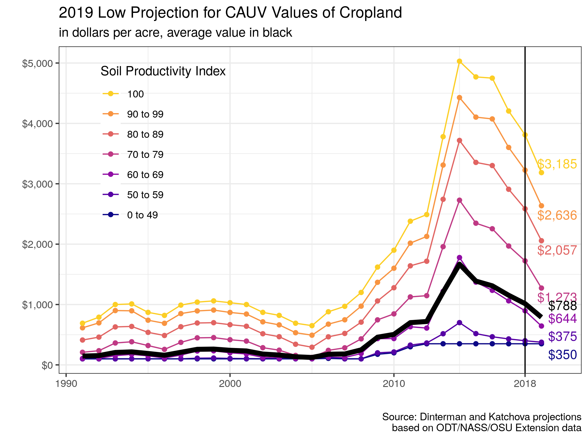
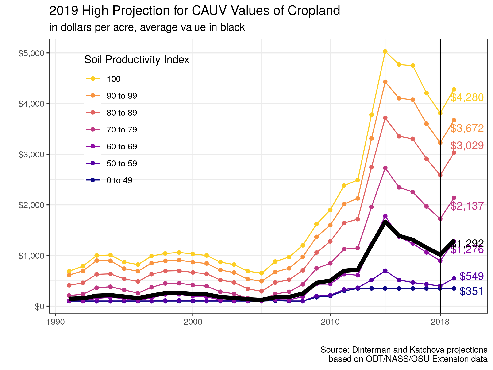

# Current Projection Figures

Current figures used in our projections, which utilize the [3-projection-viz.R](3-projection-viz.R).

## Expected Projection

Expected projection for 2019 by soil productivity index:

Which includes a phase-in period, here is the phase-in adjustment:

## Low Projection

Because of the nature of Olympic averages, we can consider the scenarios where the yields and prices turn out to be as low as possible and non-land costs and capitalization rate end up as high as possible. This would result in the lowest possible CAUV value, which at this time would be:

This scenario includes a phase-in period, here is the phase-in adjustment:

## High Projection

In contrast to the low projection, we can also consider the scenario which leads to the highest possible CAUV, which would result in CAUV values by soil productivity type of the following:

This scenario would not include a phase-in adjustment.