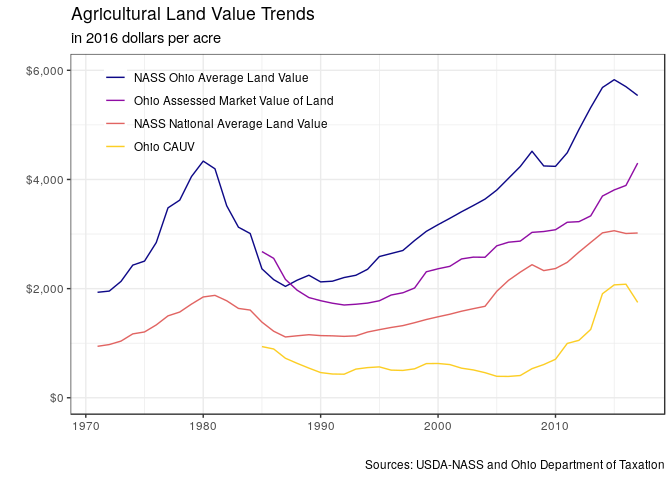
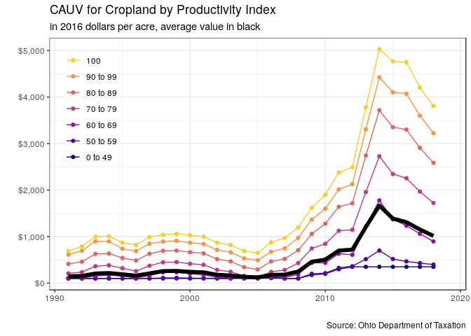
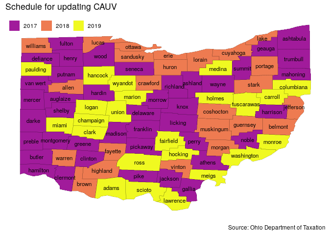

# Questions

## What is the CAUV Program, why does it exist, and what the heck goes into it?

- Optional program for farmers with more than 10 acres of land to enroll in calculating their property tax value based off of agricultural conditions instead of market conditions, almost everyone participates
- Started in the 1970s -- its primary stated intent has been to combat urbanization which can put upward pressure on farms property values and hence their tax
- The objective of the CAUV program was to discourage the sale of farmland for development purposes by providing the farmer with a tax break (http://www.the-daily-record.com/opinion/20120214/understanding-cauv-tax-program)
- Attempts to tie the property value of a farm to its agricultural use and not its "next best use"
- The formula involves:
    - Soil type/quality, yields/prices/non-land costs for corn/soybeans/wheat, and a capitalization rate
    - Higher quality soil has higher CAUV
    - All values are based on at least 5 historical values, usually through an Olympic average where the highest and lowest values are dropped

All categories are Olympic averages with the exception of rotation and yields.

| Tax Year|Capitalization Rate |Yields    |Prices    |Non-Land Costs |Rotation  |
|--------:|:-------------------|:---------|:---------|:--------------|:---------|
|     2005|1999-2005           |1984      |1997-2003 |1998-2004      |ad hoc    |
|     2006|2000-2006           |1995-2004 |1998-2004 |1999-2005      |ad hoc    |
|     2007|2001-2007           |1996-2005 |1999-2005 |2000-2006      |ad hoc    |
|     2008|2002-2008           |1997-2006 |2000-2006 |2001-2007      |ad hoc    |
|     2009|2003-2009           |1998-2007 |2001-2007 |2002-2008      |ad hoc    |
|     2010|2004-2010           |1999-2008 |2002-2008 |2003-2009      |2004-2008 |
|     2011|2005-2011           |2000-2009 |2003-2009 |2004-2010      |2005-2009 |
|     2012|2006-2012           |2001-2010 |2004-2010 |2005-2011      |2006-2010 |
|     2013|2007-2013           |2002-2011 |2005-2011 |2006-2012      |2007-2011 |
|     2014|2008-2014           |2003-2012 |2006-2012 |2007-2013      |2008-2012 |
|     2015|2009-2015           |2005-2014 |2008-2014 |2009-2015      |2010-2014 |
|     2016|2010-2016           |2006-2015 |2009-2015 |2010-2016      |2011-2015 |
|     2017|2011-2017           |2007-2016 |2010-2016 |2011-2017      |2012-2016 |
|     2018|2012-2018           |2008-2017 |2011-2017 |2012-2018      |2013-2017 |
|     2019|2013-2019           |2009-2018 |2012-2018 |2013-2019      |2014-2018 |
|   Future|current-6 years ago |previous-11 years ago |previous-7 years ago |current-6 years ago |previous-5 years ago |
|    Years|7 Olympic |10 Average, lag |7 Olympic, lag |7 Olympic |5 Average, lag |

Sources and timing of release:

1. Capitalization Rate - interest rates come from Ohio Department of Taxation while the equity rate comes from [USDA-ERS](https://www.ers.usda.gov/data-products/farm-income-and-wealth-statistics/) which has updates each year in February (should be considered "official"), August, and November.
    - [USDA data files](https://www.ers.usda.gov/data-products/farm-income-and-wealth-statistics/data-files-us-and-state-level-farm-income-and-wealth-statistics/), should select the Farm Income Statements and then returns to operators
2. [Crop Production Reports](https://usda.mannlib.cornell.edu/MannUsda/viewDocumentInfo.do?documentID=1046) affects yields and rotation. Typically there is an August, September, October, and November forecast. Then [finalized values](https://usda.mannlib.cornell.edu/MannUsda/viewDocumentInfo.do?documentID=1047) occur in January of the following year. The USDA Quick Stats API will incorrectly place the most recent forecast value for the current year in the "YEAR" reference period. This needs to be accounted for.
3. Prices are for the marketing year period which are published by the [USDA-NASS](http://usda.mannlib.cornell.edu/MannUsda/viewDocumentInfo.do?documentID=1002) and have monthly prices. However, the official values come out around March each year.
4. Non-Land Costs maintained at the [Ohio State Extension website](https://farmoffice.osu.edu/farm-management-tools/farm-budgets) and there will usually be an initial estimate for the budgets in October of that year with the final update usually around May.

## Has this been an effective program?

- Well that depends who you ask -- it has been effective to reduce the average CAUV property value over the years to at least 60% of average market value in a county
    - At the same time, the reduction in agricultural property values results in a shifting of the tax burden for residential land -- so if you ask your typical homeowner then this program stinks
    - Some counties have struggled with budgetary issues because of the CAUV changes, so they might not enjoy this
    - The extremely low CAUV values in 2005 triggered the adjustment to yields, partly from the homeowners and counties
- But there are certainly instances where highly productive soils exceeded their market value, although the lowest is always used for property tax assessment purposes
- Historically, 1985 had average CAUV of 35% of market value and this trended down to about 14% in 2006. A steady rise has resulted in averages above 50% the last 3 years but this should come down

 year  Ohio Assessed Market Value of Land   Ohio CAUV        Ratio  Property Tax 
-----  -----------------------------------  ----------  ----------  -------------
 1985  $1,378                               $482         0.3500964  $NA          
 1986  $1,341                               $469         0.3500119  $NA          
 1987  $1,166                               $389         0.3338258  $NA          
 1988  $1,097                               $351         0.3201732  $4.90        
 1989  $1,061                               $314         0.2961261  $4.62        
 1990  $1,066                               $277         0.2596851  $4.19        
 1991  $1,073                               $270         0.2514389  $4.04        
 1992  $1,077                               $274         0.2541885  $4.16        
 1993  $1,112                               $341         0.3066224  $5.36        
 1994  $1,149                               $366         0.3187499  $5.47        
 1995  $1,202                               $383         0.3186032  $5.89        
 1996  $1,296                               $349         0.2693014  $5.38        
 1997  $1,348                               $351         0.2605236  $5.36        
 1998  $1,424                               $376         0.2638681  $5.71        
 1999  $1,658                               $450         0.2712735  $6.83        
 2000  $1,736                               $462         0.2659053  $6.82        
 2001  $1,809                               $457         0.2527020  $6.82        
 2002  $1,941                               $414         0.2132366  $6.22        
 2003  $2,005                               $397         0.1981093  $6.02        
 2004  $2,058                               $368         0.1786110  $5.68        
 2005  $2,297                               $325         0.1412912  $5.16        
 2006  $2,424                               $333         0.1372609  $5.32        
 2007  $2,506                               $356         0.1420226  $5.71        
 2008  $2,697                               $475         0.1760780  $7.69        
 2009  $2,732                               $546         0.1998910  $8.88        
 2010  $2,796                               $641         0.2293531  $10.57       
 2011  $2,980                               $923         0.3095819  $15.52       
 2012  $3,046                               $994         0.3264738  $16.92       
 2013  $3,196                               $1,202       0.3758907  $20.63       
 2014  $3,609                               $1,862       0.5158883  $32.60       
 2015  $3,757                               $2,041       0.5431598  $35.04       
 2016  $3,890                               $2,081       0.5348508  $35.66       
 2017  $4,387                               $1,783       0.4063974  $30.58       

(Note these are for assessed properties and does not treat soil types equally like later calculations do)

## What changes have been made to the program and why?

- Document main changes:
    - 2006 yield update started an increase - Farm Bureau had concerns the program would be revoked due to unjustifiably low CAUV values
        - Then high crop prices pushed the values upward
        - Declining interest rates also caused an upward rise in CAUV
    - Large complaints about the rapidly increasing property tax bills of farmers: the state average was about \$5.32 per acre in 2006 and quickly quadrupled to \$20.63 in 2013.
    - 2015 adjustment to decrease lags in components began the decline in CAUV values and higher clearing/drainage costs
    - 2017 changed in capitalization rate which will be phased in over a period of time
- [Wood County Document](http://www.co.wood.oh.us/auditor/pdfs/2015/CAUV/History%20of%20CAUV.pdf)
- New minimum values of \$350 for cropland and \$230 for woodland
    - Woodland value is the cropland value less clearing and drainage costs. Clearing is now \$1,000 per acre (up from \$500 in 2014) and drainage is \$800 for somewhat poorly drained, poorly drained, very poorly drained, and saturated (ie soils which are not well drained)
    - Land in conservation is now assessed \$230, the lowest value that can occur

 year  corn_price   corn_price_odt   corn_price_cauv_exp   soy_price   soy_price_odt   soy_price_cauv_exp   wheat_price   wheat_price_odt   wheat_price_cauv_exp 
-----  -----------  ---------------  --------------------  ----------  --------------  -------------------  ------------  ----------------  ---------------------
 2006  $3.08        $1.99            $1.97                 $6.46       $4.84           $5.04                $3.35         $2.49             $2.59                
 2007  $4.29        $1.96            $2.06                 $9.93       $4.89           $5.38                $5.37         $2.64             $2.87                
 2008  $4.21        $2.02            $2.29                 $10.30      $5.19           $5.83                $5.82         $2.89             $3.05                
 2009  $3.55        $2.29            $2.70                 $9.78       $5.60           $6.63                $4.41         $3.05             $3.61                
 2010  $5.45        $2.66            $2.89                 $11.50      $6.41           $7.97                $5.21         $3.41             $3.77                
 2011  $6.44        $2.89            $3.26                 $13.00      $7.22           $8.57                $6.73         $3.64             $4.22                
 2012  $7.09        $3.19            $3.93                 $14.60      $7.74           $9.08                $7.94         $3.98             $4.55                
 2013  $4.41        $3.91            $4.54                 $13.00      $8.98           $10.40               $6.54         $4.54             $5.19                
 2014  $3.78        $4.48            $4.70                 $10.30      $10.13          $11.07               $5.60         $5.16             $5.64                
 2015  $3.89        $4.55            $4.57                 $9.16       $11.09          $11.08               $4.57         $5.67             $5.69                
 2016  $3.61        $4.49            $4.50                 $9.66       $10.91          $10.91               $4.25         $5.53             $5.53                
 2017  $3.55        $4.51            $4.50                 $9.50       $10.83          $10.83               $4.90         $5.53             $5.53                
 2018  $NA          $4.18            $4.17                 $NA         $10.43          $10.43               $NA           $5.52             $5.52                
 2019  $NA          $NA              $3.75                 $NA         $NA             $9.79                $NA           $NA               $5.13                

## So the new 2017 changes have affected me already?

- Not quite, for one this will be phased in over the 2016 CAUV values so as to not reduce values dramatically.
- Depends on your county, 2017 had about half the state adjust while 2018 has a quarter and 2019 the remaining quarter.
    - CAUV values will update once every three years, but it depends on which county you live in. There will be about a quarter of the counties updated this year, last tax season had roughly half and in 2019 there will be the remaining counties updated.
    - Starting in 2020, there will be no more phase-in procedure

## How much will this phase in process affect my CAUV?

- In 2017 estimates, the average soil CAUV is around \$1,150 but this includes a phased in adjustment factor of around \$150. If this were 2020, then we would have seen values of around \$1,000
- For 2018, the average soil CAUV was \$1,015 but the phase-in adjustment was around \$140.
- Our current projections for 2019 is to see about a 13\% decline in CAUV value of around \$890 which would have a phase-in of about \$130.
    - This is the last year of the phase-in, the 2020 values would be \$760 if there are no changes to CAUV values because the phase-in would not apply.

 year  avg_cauv   indx_49   indx_59   indx_69   indx_79   indx_89   indx_99   indx_100   avg_change 
-----  ---------  --------  --------  --------  --------  --------  --------  ---------  -----------
 1991  $146       $100      $101      $106      $209      $412      $614      $690       NA%        
 1992  $154       $100      $100      $107      $235      $460      $696      $790       5.48%      
 1993  $206       $100      $100      $153      $363      $629      $900      $1,000     33.77%     
 1994  $216       $100      $100      $174      $383      $637      $896      $1,010     4.85%      
 1995  $189       $100      $101      $150      $320      $539      $740      $870       -12.50%    
 1996  $160       $100      $100      $114      $257      $487      $689      $820       -15.34%    
 1997  $209       $100      $100      $163      $373      $632      $850      $990       30.62%     
 1998  $258       $100      $111      $230      $448      $694      $894      $1,040     23.44%     
 1999  $262       $100      $114      $233      $452      $699      $908      $1,060     1.55%      
 2000  $242       $100      $107      $200      $417      $666      $869      $1,030     -7.63%     
 2001  $231       $100      $104      $181      $394      $640      $842      $1,000     -4.55%     
 2002  $180       $100      $102      $125      $285      $516      $713      $870       -22.08%    
 2003  $163       $100      $101      $113      $244      $467      $663      $820       -9.44%     
 2004  $135       $100      $114      $104      $157      $342      $533      $690       -17.18%    
 2005  $123       $100      $106      $101      $124      $293      $492      $650       -8.89%     
 2006  $177       $108      $134      $125      $241      $465      $675      $880       43.90%     
 2007  $181       $100      $100      $123      $283      $521      $747      $970       2.26%      
 2008  $249       $100      $100      $188      $431      $708      $973      $1,200     37.57%     
 2009  $459       $176      $200      $435      $746      $1,059    $1,368    $1,620     84.34%     
 2010  $505       $200      $214      $436      $845      $1,278    $1,601    $1,900     10.02%     
 2011  $700       $300      $328      $632      $1,126    $1,641    $2,017    $2,380     38.61%     
 2012  $719       $350      $363      $610      $1,147    $1,717    $2,128    $2,490     2.71%      
 2013  $1,205     $350      $516      $1,218    $1,958    $2,743    $3,310    $3,780     67.59%     
 2014  $1,668     $350      $700      $1,778    $2,728    $3,718    $4,428    $5,030     38.42%     
 2015  $1,388     $350      $518      $1,371    $2,347    $3,354    $4,104    $4,770     -16.79%    
 2016  $1,310     $350      $466      $1,235    $2,255    $3,302    $4,074    $4,750     -5.62%     
 2017  $1,153     $350      $430      $1,061    $1,969    $2,909    $3,602    $4,205     -11.98%    
 2018  $1,015     $350      $400      $896      $1,723    $2,586    $3,226    $3,810     -11.97%    
 2019  $887       $350      $379      $743      $1,491    $2,298    $2,892    $3,445     -12.57%    

## How do you make these projections?

- Based off of current expectations of prices, yields, non-land costs, and interest rates
    - Prices carry forward the most recent USDA values
    - Yields and rotation use the August forecast values from USDA which, will be updated with the September, October, and November forecasts. Finalized in January 2019.
    - Non-land costs use Ohio State Extension budgets carrying forward values from 2018 as place-holder for 2019. Will be updated when preliminary budget estimates are released
    - Interest rates carry forward current values

## Once this takes effect fully -- I will definitely see a decrease in my CAUV?

- It is highly likely but not certain, it will still depend on yield/price and interest rate trends
- Even if you realize a decreased CAUV, your tax rate might change
- **CAUV is different than property tax**
    - CAUV gives the property value of which you're taxed but not the actual tax you pay
    - Ohio has a taxable value of 35% property value, but then the "millage rate" will depend on your county, municipality, and school district
    - Millage rates might increase, so your CAUV might go down but tax rate could increase
- Keep in mind that while the average in Ohio for property tax per acre was about $31.55 the minimum was $5.93 for monroe and maximum was $98.29 for cuyahoga

## How does CAUV compare to other states?

All of the surrounding states do provide some sort of differential tax treatment

- Indiana is most similar in using a use-value formulation but also use cash rents in their formula
    - \$35 to \$42 property tax paid per acre of farmland in Indiana for 2016 
- Illinois is about \$17 to \$20 per acre
- West Virginia: about \$1.50 per acre
- Kentucky has been in trouble with improper classification of farmland (used for commercial development but received preferable farmland taxation.)

# Was there a change in the conservation assessment?

Yes, in 2017 one large change was that land enrolled in conservation is now assessed at the lowest value (\$230) whereas before its CAUV value was still based on the soil type.

- In 2017, there were 16,007,314 acres enrolled in CAUV -- which has been pretty stable.
    - There were 257,519 acres enrolled in CRP
    - Not a _large_ issue, but still of interest.
- Will be interesting to keep track of enrollment, farmers have a bit more incentive to enroll into CRP

Acreage history for CRP:

 YEAR  US           OHIO      fraction 
-----  -----------  --------  ---------
 1986  1,926,692    8,171     0.424%   
 1987  15,331,971   99,651    0.650%   
 1988  23,845,154   139,207   0.584%   
 1989  28,850,447   195,669   0.678%   
 1990  32,496,627   243,152   0.748%   
 1991  32,969,180   262,679   0.797%   
 1992  33,966,698   313,153   0.922%   
 1993  34,988,426   365,984   1.046%   
 1994  34,988,426   365,984   1.046%   
 1995  34,952,266   364,534   1.043%   
 1996  34,478,302   352,961   1.024%   
 1997  32,792,055   327,177   0.998%   
 1998  30,108,903   320,145   1.063%   
 1999  29,797,800   296,109   0.994%   
 2000  31,394,934   280,632   0.894%   
 2001  33,578,202   300,540   0.895%   
 2002  33,934,239   304,836   0.898%   
 2003  34,080,953   301,552   0.885%   
 2004  34,676,658   276,465   0.797%   
 2005  34,871,389   287,956   0.826%   
 2006  35,972,520   329,639   0.916%   
 2007  36,740,293   362,311   0.986%   
 2008  34,584,010   352,248   1.019%   
 2009  33,692,761   347,521   1.031%   
 2010  31,270,394   343,584   1.099%   
 2011  31,103,325   343,619   1.105%   
 2012  29,505,418   336,198   1.139%   
 2013  26,819,626   317,073   1.182%   
 2014  25,429,615   278,409   1.095%   
 2015  24,167,810   267,227   1.106%   
 2016  23,865,634   263,381   1.104%   
 2017  23,415,018   257,519   1.100%   

