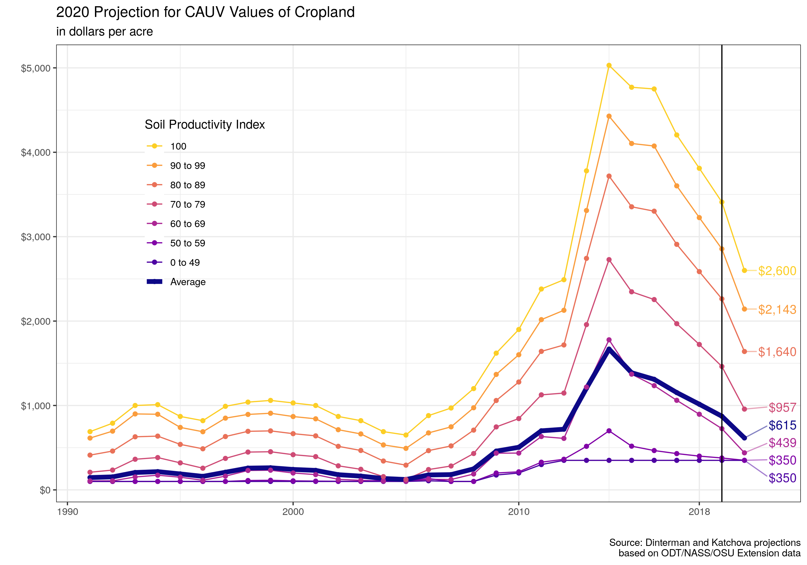

```{r setup, include=FALSE}
library("broom")
library("car")
library("knitr")
library("tidyverse")
opts_chunk$set(echo = TRUE, message = FALSE, echo = FALSE, message = FALSE, warning = FALSE)
assessment_cycle <- read_csv("../0-data/odt/tax_reappraisals.csv") %>% 
  mutate(either = pmax(reappraisal, update + 6),
         either = if_else(either < 2018, either + 3, either))

cauv_soils <- read_rds("../0-data/soils/cauv_soils.rds")
cauv_unadj <- read_rds("../0-data/soils/cauv_unadj.rds")
soils <- cauv_soils %>% 
  select(soil_series:drainage, indx:prod_index_new) %>% 
  distinct()
nrcs_soil <- read_rds("../0-data/soils/nrcs_county_soils.rds")
nrcs_soil_alt <- read_rds("../0-data/soils/nrcs_county_soils_alt.rds")
ohio_exp <- read_rds("../3-proj/future/recreated_through_2020.rds") %>% 
  arrange(id, year) %>% 
  group_by(id) %>% 
  mutate(cauv_change_raw = unadjusted - lag(unadjusted),
         cauv_change_pct = cauv_change_raw / lag(unadjusted)) %>% 
  ungroup()
```

In times of low farm incomes, one benefit of the lower price environment is that property taxes on farmland across Ohio should be experiencing some relief from its highs around 2014 to 2016. OSU agricultural economists Robert Dinterman and Ani Katchova forecast a decrease in the assessed value of agricultural land enrolled in the Current Agricultural Use Value Program (CAUV) for 2020 with an anticipated average CAUV value of approximately \$600 in 2020. Based on current projections of each component in the CAUV calculation, the economists are anticipating an additional uptick for 2021 with an average CAUV value of around \$650. The economists caution that the 2021 projection has more uncertainty than their current projection for 2020. The 2020 tax year is the first year that no "phase-in" adjustment will be made to the CAUV values which contributes to its decline from \$1,153
in 2017, to \$1,015 in 2018, and then \$876 in 2019.



CAUV values are assigned to each of the over 3,000 different soil types in Ohio for property tax assessment purposes. The underlying yield capacity of each soil type determines its exact CAUV value with higher productive soil types receiving higher CAUV values for tax purposes. The program mandates a minimum value for CAUV which is current set at \$350. The economists currently anticipate the highest productivity soils in Ohio could reach around \$2,540 in CAUV value for 2020.

The program began in the 1970s in response to development pressure for farmers across the state which pushed up their property taxes due to urbanization. The motivation for CAUV is to assess farmland at its agricultural productivity rather than the market value of the land to alleviate the urbanization pressure faced by farmers and disencentivize farmers from selling land to developers -- thus preserving farmland in Ohio. The formula for CAUV values incorporates agricultural factors (soil types, yields, prices, and non-land costs for corn, soybeans, and wheat) to calculate the capitalized net returns to farming land based on the previous 5 to 10 years. The average CAUV value of farmland increased from approximately \$123 in 2005 to its peak of \$1,668 in 2014 largely due to high crop prices and low interest rates during this time.

CAUV underwent large-scale changes to its calculation in 2017 that was targeted to reduce the property tax burden of farmland and the new values were scheduled to be "phased-in" over an assessment cycle. The "phase-in" for the 2017, 2018, and 2019 tax years was that only one-half the difference between the old CAUV formula versus the new CAUV formula would be in place. If the "phase-in" were not in place for those years, then the corresponding CAUV values for those years would have been about \$1,000 in 2017, \$875 in 2018, and \$740 in 2019. For 2020 and beyond, only the new CAUV formula values will be used which is one reason why there will be a decrease in CAUV values for 2020.

Property in Ohio is reappraised once every six years with a sales-based adjustment halfway through the assessment cycle. Adjustments to CAUV values follows this schedule which means that farmland receives updated CAUV values once every three years. The cycle depends on the county and there will be `r sum(assessment_cycle$either == 2020, na.rm = T)` counties receiving a reppraisal or adjustment in 2020, `r sum(assessment_cycle$either == 2018, na.rm = T)` counties in 2021, and finally the remaining `r sum(assessment_cycle$either == 2019, na.rm = T)` counties in 2022 which will be when all counties have completed the "phase-in" period.

The other major reason for decreased CAUV values in 2020 is because the high crop prices for corn, soybeans, and wheat from 2012 will drop out of the formula. The CAUV formula uses an Olympic average of prices for the previous 7 years of available data (i.e. the 2020 tax year will use prices from 2013-2019) and lower prices will result in lower net returns in the CAUV formula which in turn implies lower CAUV values.

The current projections for 2021 have a corresponding uptick in CAUV values mostly due to their projection of lower interest rates entering the calculation of the capitalization rate. In the CAUV formula, net returns are divided by the capitalization rate which implies that a lower capitalization rate will lead to higher CAUV values. With the Federal Reserve recently reducing interest rates, this will likely reduce the capitalization rate in the CAUV formula. However, there is still a large amount of unknown data for the 2021 tax year and agricultural conditions can still change that makes the current 2021 projections more uncertain.

While CAUV values will determine the assessed value of farmland for property tax purposes, the actual property tax will depend on the various levies that may be in place for where the farmland is located. In Ohio, property tax levies can originate from counties, municipalities, townships, and school districts which makes it difficult to determine the average property tax paid. It is also important to note that CAUV values only affect the property tax on land – buildings, improvements, and homes are still
taxed based on their market value.
