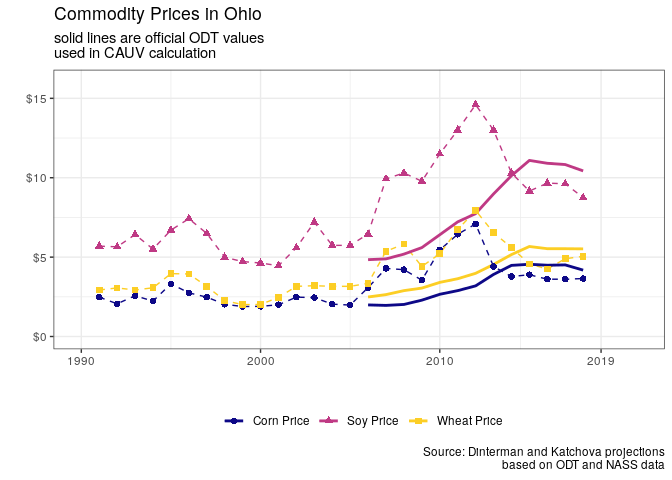
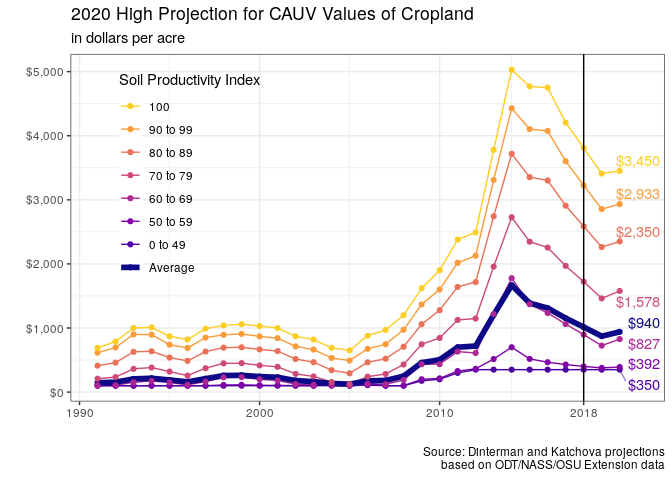
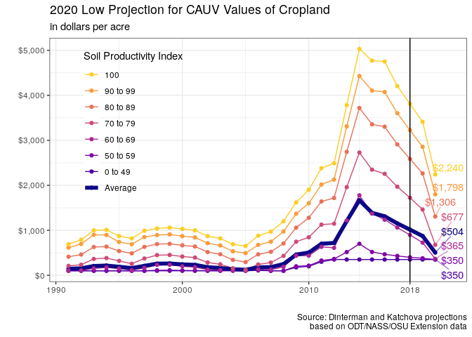

# Key Findings

The purpose of this report is to provide projections of property tax for agricultural land in Ohio for tax years 2019 and 2020. The projections apply for all soil types in Ohio enrolled in the Current Agricultural Use Value Program (CAUV). Further, the CAUV formula that is used to calculate CAUV values based on soil types is explained, along with the components of the formula and the assumptions that are used to make expected, high, and low CAUV value projections for 2019 and 2020. Legislation passed in 2017 altered CAUV calculations, which are detailed in this report. We explain the current methodology for calculating CAUV values and how these projections were made. We used Ohio Department of Taxation (ODT) descriptions of calculations, the [Ohio Code of legislation](http://codes.ohio.gov/orc/5713.31) on CAUV, and the [phase-in legislation](http://codes.ohio.gov/orc/5715.01) for the new calculations.

**Key Findings**

- Project a decrease in the average CAUV value across all soil types in Ohio to approximately $875 in the 2019 tax year. This represents a -14% change from the average 2018 CAUV value of $1,015, although counties receiving updates in 2019 last updated CAUV values in 2016 and we project a -33% change from the average 2016 CAUV value of $1,310.
- The 2019 tax year is the third year of the phase-in from large-scale changes in the calculation of CAUV values. If the phase-in procedure was not in place, then the average 2019 CAUV values would have further dropped to approximately $730.
- Due to uncertainty in finalized input data used in our 2019 CAUV calculations, it is possible for the average CAUV value to change from 2018 average CAUV value by as much as -22% while it is also possible for the average CAUV value to rise by over 27%. However, an increase in CAUV values for 2019 is unlikely.
- Current CAUV projections for the 2020 tax year, which represents the first year without the phased-in procedure, expects a further decline in the average CAUV value to $585 which would be a -33% change from current projections in 2019. Counties receiving an update in 2020 last received an update in 2017 and we anticipate a -49% change from 2017 when the average CAUV value was $1,155.
- Due to uncertainty in finalized input data used in our 2020 CAUV calculations, it is possible for the average CAUV value to change from 2019 average CAUV value by as much as -42% while it is also possible for the average CAUV value to rise by over 8%. However, an increase in CAUV values for 2020 is unlikely.

\newpage
\setstretch{1.5}

# CAUV Value Projections for 2019 and 2020

In 2018, the average CAUV value across all soil types was $1,015 per Ohio Department of Taxation (ODT). Our projection for the average value of CAUV in the 2019 tax year is $873. Our projections are partially based on how the CAUV formula use Olympic averaging[^olympic] for certain components and it is possible for a potential high of $1,292 and a low of $788 for average CAUV values. However, eventual CAUV values are unlikely to have a substantial divergence from our expected projections based on the currently available data for components which use Olympic averaging.

<!-- ODT provides [general information](https://www.tax.ohio.gov/real_property/cauv.aspx) on their calculations for CAUV and how they calculate the CAUV value for each soil type across Ohio although this document will also describe the calculation procedure. Their information also includes the official values of inputs that ODT uses in the formula for CAUV values and is the only official documentation and values for CAUV. -->

 <!-- -- however with as much information currently known these high or low scenarios are unlikely and we anticipate only slight divergences from average CAUV value projection of $873 -->

[^olympic]: A 7-year Olympic average is a mean of the previous 7 values after first removing the highest and lowest values from calculation. For projections, we assume the most recent data is either the highest/lowest value in the 7 year span.

Updates to CAUV values do not occur equally across Ohio as there is a rotating schedule for tax assessments in Ohio. [Once every six years](https://www.tax.ohio.gov/real_estate/reappraisal_and_triennial_update.aspx), a county receives a full reappraisal of their property with an adjustment in the third year in between. Each county receives an update to their CAUV values for the years a reappraisal or adjustment occurs. About a quarter of the state received a CAUV value update in 2018, another quarter in 2019, and about half of the state will see updates in 2020. Figure \ref{fig:update-map} provides a reference for when a county receives an update to their CAUV values:

\label{fig:update-map}

CAUV values contain 5 major components used as inputs for projecting values: capitalization rate, commodity yields, commodity prices, commodity acreage/rotation, and non-land input costs. The commodities used in CAUV are corn, soybeans, and wheat. Each of these components are projected into the future to obtain the projections for 2019 and 2020 CAUV values. 

Our projections for the CAUV values in the 2019 tax year are for the components of commodity yields, commodity rotation, and capitalization rate to remain largely unchanged from 2018. Input costs are expected to decline, although this is counteracted with commodity prices similarly expected to decline. Under the expected scenario, the average CAUV value will continue to decline by a similar proportion as the fall in the CAUV values from 2016 to 2017 and then to 2018. Grouping soil types based on a productivity index can help display how similarly productive soils are expected to decline in our 2019 projections:

\label{fig:exp-trend}

The projected CAUV values are partially offset by the current provision in the CAUV calculations that phases in the new formula for CAUV, smoothing the adjustment to lower CAUV values the one cycle of property reassessment rather than these declines occurring immediately. The 2018 values had an adjustment factor where only half of the difference was included between the 2017 CAUV value and what the pre-adjusted 2018 CAUV would have been. This also occurs for 2019, where if the calculated CAUV value in 2019 is lower than the 2018 CAUV value for a soil type then only half of the difference is factored into the actual 2019 CAUV value. While the projected average CAUV value for 2019 is $873, the value would have been $730 without the phase-in. Figure \ref{fig:exp-2019} shows how much this adjustment for phasing in of the new calculations differ by soil types:

\label{fig:exp-2019}

This adjustment procedure will not be present in the 2020 tax year and beyond as the phase-in was only intended to affect one set of phased-in values based on the triennial update of property assessments. Because of this, we have further pushed our projections for the 2020 tax year by extending each component in the CAUV calculation an additional year with as much of the available data as possible.

Our preliminary results indicate stable values for commodity yields, commodity rotation, and capitalization to remain similar to our projections for 2019. Further, the input costs and commodity prices are anticipated to further decline with a more pronounced decline for prices than input costs. At this time, our expected projections for the 2020 tax year are:

\label{fig:exp-trend-2020}

\newpage

# Current Agricultural Use Value Program Overview

In 1974, Ohio enacted the Current Agricultural Use Value Program (CAUV) as a tax incentive for farmers to continue agricultural production on their land instead of selling it due to urbanization pressure. CAUV provides an appraisal method for valuing agricultural land by use of only agricultural inputs rather than the market value of land. Throughout the 1970s, other states adopted similar programs of differential appraisal methods of agricultural land and, as of 2014, all 50 states within the US provide some form of differential tax treatment of agricultural land. While each state has its own reason for enacting preferential tax treatment and its particular calculation, the intent behind differential taxation is generally understood as applying a net present valuation of agricultural production that is not tied to potential urbanization development pressures. Ohio is no different and has developed its own calculation method that depends on soil quality, commodity yields/prices/rotation, operational costs, and capitalization rate. The basic premise has been in place since the late 1970s although the program has become more sophisticated and received substantial updates in 2006, 2015, and most recently in 2017 that have affected the calculation of CAUV.

No matter what commodity a farmer produces, their CAUV value is determined solely based on their soil type and a formula from the Ohio Department of Taxation (ODT) which aims to represent the expected returns for an average farmer in Ohio. A simplified version of the calculation can be stated as:

> The CAUV value is the expected net present value of an acre of land based on expected net income of the land used for agricultural purposes. To determine this, first a historical average of yields and prices for corn, soybeans, and wheat is used to determine gross income. Then historical non-land costs -- provided by The Ohio State University Extension -- are subtracted from gross income for a measure of net income. And finally, this net income is divided by a capitalization rate based upon historical values of farm interest and equity rates. This CAUV value will vary based upon the particular soil type(s) for a farm.

For agricultural land to be eligible for CAUV, it must either be at least 10 acres devoted exclusively to commercial agricultural use or be able to produce more than \$2,500 in average gross income. The general trend for the state of Ohio since the 1980s has been a steady increase in the total acreage enrolled in CAUV, although there have been declines in enrolled CAUV acreage for areas under urbanization pressure as farmland is converted to residential or commercial purposes. When a land owner decides to unenroll from CAUV for this purpose, they must pay a recoupment penalty that is equal to the CAUV tax savings for the previous 3 tax years -- i.e. the difference between the market value and CAUV value.

## CAUV Value Formula

For each of the over 3,500 soil types ($s$) in Ohio, a particular year's ($t$) CAUV value is calculated as the soil's net income divided by the capitalization rate:

$$
CAUV_{s,t} = \frac{NOI_{s,t}}{CAP_t} \label{eq:cauv}
$$

where $CAP_t$ represents the capitalization rate and $NOI_{s,t}$ represents the net operating income based on revenues less non-land costs for corn, soybeans, and wheat.

## Net Operating Income

Net operating income, ${NOI_{s,t}}$, captures the average returns to an acre of land under normal management practices which is adjusted by the state-wide rotation pattern of commodities. In other words, a net income for corn, soybeans, and wheat is calculated for each soil type and then these net incomes for a given soil type are averaged in proportion to the state-wide acreage of harvested corn, soybeans, and wheat. This can be defined as:

$$
NOI_{s,t} = \sum_{c} w_{c,t}\times(GOI_{s,c,t} - {nonland}_{s,c,t})
$$

where $c$ denotes the commodity type, which is either corn, soybeans, or wheat which represent the dominant commodities in Ohio and $w_{c,t}$ is commodity's share of state production. $GOI_{s,c,t}$ is the gross operating income for a soil type and is calculated for each of the commodity types (corn, soybeans, and wheat) based on yields and prices. ${nonland}_{s,c,t}$ is the non-land costs associated with each commodity type. Both of these variables are further explained in the following sections.

### Rotation

Each commodity's share of state production is based on a 5-year average of total acres harvested between the three commodities -- with weights summing to 1. This is done by summing up the total harvested acreage for corn, for soybeans, and for wheat over the past six years ignoring the current -- i.e. 2019 value for CAUV calculations uses 2014 to 2018 harvested acres. Once summed up, each commodity is then assigned their share of total harvested for the entire state based on those past six years ignoring the current.

These data are from the United States Department of Agriculture (USDA) [Crop Production Reports](https://usda.mannlib.cornell.edu/MannUsda/viewDocumentInfo.do?documentID=1046). Typically there is an August, September, October, and November forecast for Ohio's corn, soybeans, and wheat acreage with the [finalized values](https://usda.mannlib.cornell.edu/MannUsda/viewDocumentInfo.do?documentID=1047) occurring in January of the following year -- i.e. 2018 harvested acreage was finalized in January 2019. The values calculated for CAUV are lagged one year -- i.e. the tax year of 2019 CAUV values for commodity rotation percentages are based on the 2014 through 2018 harvested acreage.

The values for rotation used in ODT calculations since 2010 are displayed in the following tables along with the values used in our 2019 and 2020 CAUV value projections.

Table: Historical Corn Rotation

 Year  ODT Value   USDA Acres Harvested   AVG Acres Harvested   Projected 
-----  ----------  ---------------------  --------------------  ----------
 2010  39.0%       3,270,000              3,210,000             37.7%     
 2011  38.6%       3,200,000              3,216,000             37.7%     
 2012  38.6%       3,650,000              3,220,000             37.7%     
 2013  38.7%       3,740,000              3,268,000             38.1%     
 2014  38.6%       3,480,000              3,276,000             38.1%     
 2015  40.0%       3,260,000              3,468,000             40.2%     
 2016  40.2%       3,300,000              3,466,000             40.1%     
 2017  40.0%       3,150,000              3,486,000             40.3%     
 2018  39.0%       3,300,000              3,386,000             39.0%     
 2019  NA%         NA                     3,298,000             38.0%     
 2020  NA%         NA                     3,264,639             37.6%     

Table: Historical Soy Rotation

 Year  ODT Value   USDA Acres Harvested   AVG Acres Harvested   Projected 
-----  ----------  ---------------------  --------------------  ----------
 2010  51.0%       4,590,000              4,448,000             52.2%     
 2011  50.9%       4,540,000              4,470,000             52.4%     
 2012  51.1%       4,590,000              4,492,000             52.6%     
 2013  51.2%       4,490,000              4,476,000             52.2%     
 2014  52.0%       4,690,000              4,546,000             52.9%     
 2015  52.6%       4,740,000              4,580,000             53.1%     
 2016  53.0%       4,840,000              4,610,000             53.4%     
 2017  54.0%       5,090,000              4,670,000             53.9%     
 2018  55.0%       4,980,000              4,770,000             55.0%     
 2019  NA%         NA                     4,868,000             56.1%     
 2020  NA%         NA                     4,919,894             56.7%     

Table: Historical Wheat Rotation

 Year  ODT Value   USDA Acres Harvested   AVG Acres Harvested   Projected 
-----  ----------  ---------------------  --------------------  ----------
 2010  10.0%       700,000                900,000               10.6%     
 2011  10.5%       850,000                912,000               10.7%     
 2012  10.3%       450,000                886,000               10.4%     
 2013  10.1%       640,000                864,000               10.1%     
 2014  9.4%        545,000                808,000               9.4%      
 2015  7.4%        480,000                637,000               7.4%      
 2016  6.8%        560,000                593,000               6.9%      
 2017  6.0%        460,000                535,000               6.2%      
 2018  6.0%        450,000                537,000               6.2%      
 2019  NA%         420,000                499,000               5.7%      
 2020  NA%         NA                     474,000               5.5%      

### Non-Land Cost

The non-land costs are calculated as 7-year Olympic averages for typical costs of producing each commodity (corn, soybeans, and wheat). The [Farm Office](https://farmoffice.osu.edu/farm-management-tools/farm-budgets) at The Ohio State University Extension conducts annual surveys for costs of production which serve as the yearly estimates that are used in the 7-year Olympic average. Budgets for a commodity marketing year are generally released in October of the prior year and then finalized in May of the marketing year -- i.e. the 2019 marketing year was initially released in October 2018 and will likely be finalized sometime after May 2019. These budgets will include both fixed (machinery, equipment, labor, etc.) and variable (seeds, fertilizer, chemicals, hauling, etc.) costs involved in producing corn, wheat, or soybeans and each of these individual components are averaged for use in CAUV calculation.

Prior to 2015, the non-land costs were lagged one year -- i.e. tax year 2014 used the values from budgets in 2007 to 2013. From 2015 onward, the current year values are included in the non-land cost calculations. Because of the nature of an Olympic average, the non-land costs used in 2019 CAUV is bounded between a "high" and a "low" value by averaging the previous 6-years after dropping only the highest or lowest value respectively. In the event that the "high" value of our projected non-land costs occur, then this is where the 2019 non-land costs are all the lowest values in the previous 7-years which causes the CAUV to be a higher value. The opposite is true for the "low" value in that the non-land costs are all 7-year highs.

Our projection of non-land base costs for corn is $519; for soybeans is $339; and for wheat is $319 per acre for 2019. For 2020, our projections are $501 for corn; $330 for soybeans; and $308 for wheat. The historical and projected values for each commodity are displayed in figure \ref{fig:viz-nonland}:

\label{fig:viz-nonland}

A base cost is assigned for each commodity and is the same across all soil types. The base cost has an associated base yield for each commodity, which is calculated from the budget reports of OSU Extension. However, each soil type has an associated expected yield (explained in the following section) and there is an adjustment applied for each commodity if the expected yield is above or below the base yield. Each additional yield above or below the base yield is multiplied by an additional cost per yield -- which is calculated in the same manner as the base costs with a 7-year Olympic average. However, these additional costs vary across soil types which makes it difficult to present for all soil types.

However, we also calculate hypothetical high or low scenarios for this year as a way to place bounds on the non-land costs of each commodity. The base and additional costs for all commodities are displayed in tables on the following pages with the associated ranges of the high or low projections.

\newpage

Table: Historical Corn Base Costs

 Year  ODT Base Cost   Projection   Low Projection   High Projection 
-----  --------------  -----------  ---------------  ----------------
 2013  $391.90         $391.81      $402.73          $346.73         
 2014  $437.85         $436.65      $447.46          $387.11         
 2015  $516.99         $517.17      $534.61          $482.37         
 2016  $524.47         $525.56      $543.88          $501.32         
 2017  $538.78         $539.63      $558.55          $520.49         
 2018  $529.28         $531.36      $560.18          $526.59         
 2019  $NA             $519.13      $552.02          $508.96         
 2020  $NA             $500.67      $530.78          $492.11         

Table: Historical Corn Additional Costs

 Year  ODT Add Cost   Projection   Low Projection   High Projection 
-----  -------------  -----------  ---------------  ----------------
 2013  $1.04          $1.07        $1.15            $0.94           
 2014  $1.18          $1.22        $1.28            $1.05           
 2015  $1.36          $1.37        $1.45            $1.24           
 2016  $1.38          $1.40        $1.45            $1.30           
 2017  $1.45          $1.48        $1.55            $1.41           
 2018  $1.44          $1.45        $1.54            $1.42           
 2019  $NA            $1.42        $1.54            $1.35           
 2020  $NA            $1.39        $1.50            $1.32           

\newpage

Table: Historical Soybeans Base Costs

 Year  ODT Base Cost   Projection   Low Projection   High Projection 
-----  --------------  -----------  ---------------  ----------------
 2013  $248.69         $247.33      $254.04          $222.23         
 2014  $275.21         $273.10      $281.00          $244.91         
 2015  $325.42         $325.63      $336.37          $304.04         
 2016  $336.33         $336.31      $345.95          $317.20         
 2017  $347.10         $345.93      $358.09          $332.61         
 2018  $346.26         $346.36      $362.54          $338.54         
 2019  $NA             $338.83      $360.25          $329.71         
 2020  $NA             $329.90      $349.32          $321.70         

Table: Historical Soybeans Additional Costs

 Year  ODT Add Cost   Projection   Low Projection   High Projection 
-----  -------------  -----------  ---------------  ----------------
 2013  $1.12          $1.15        $1.29            $0.95           
 2014  $1.27          $1.25        $1.45            $1.10           
 2015  $1.24          $1.16        $1.34            $1.14           
 2016  $1.07          $1.07        $1.14            $1.06           
 2017  $1.05          $1.04        $1.13            $1.04           
 2018  $0.94          $0.95        $1.03            $0.93           
 2019  $NA            $0.91        $0.98            $0.83           
 2020  $NA            $0.90        $0.96            $0.80           

\newpage

Table: Historical Wheat Base Costs

 Year  ODT Base Cost   Projection   Low Projection   High Projection 
-----  --------------  -----------  ---------------  ----------------
 2013  $230.62         $227.23      $234.81          $204.78         
 2014  $255.48         $257.01      $267.95          $225.96         
 2015  $296.98         $290.70      $302.29          $265.08         
 2016  $323.52         $319.80      $329.78          $296.39         
 2017  $336.21         $335.65      $347.61          $315.83         
 2018  $330.53         $330.72      $349.28          $325.70         
 2019  $NA             $318.70      $340.42          $310.89         
 2020  $NA             $307.50      $328.52          $299.94         

Table: Historical Wheat Additional Costs

 Year  ODT Add Cost   Projection   Low Projection   High Projection 
-----  -------------  -----------  ---------------  ----------------
 2013  $1.61          $1.70        $1.78            $1.47           
 2014  $1.80          $1.89        $1.99            $1.68           
 2015  $1.77          $1.80        $1.94            $1.77           
 2016  $1.64          $1.67        $1.79            $1.64           
 2017  $1.62          $1.65        $1.78            $1.66           
 2018  $1.49          $1.51        $1.68            $1.49           
 2019  $NA            $1.41        $1.56            $1.31           
 2020  $NA            $1.34        $1.47            $1.25           

\newpage

## Gross Operating Income

Gross operating income, $GOI_{s,c,t}$, is based on historical state-wide yields and prices for each commodity which are multiplied together to approximate the expected revenues. The gross operating income across soil types and for each commodity is defined as:

$$
GOI_{s,c,t} = Price_{c,Ohio,t} \times \left( \frac{Yield_{c,Ohio,t}}{Yield_{c,Ohio,1984}} \times Yield_{c,s,1984} \right)
$$

### Price

Price for each commodity is a 7-year Olympic average of past marketing year prices that is also weighted by total production as measured in bushels for each marketing year with 5\% subtracted from the price to account for management costs. Both the price and production values are from USDA-NASS reports.

Prior to 2015, the Olympic average for price was lagged two years -- i.e. the 2014 tax year used the USDA prices from 2006 through 2012. Since 2015, the lag has been reduced to one year -- i.e. the 2015 tax year used the USDA prices from 2008 through 2014. Because of the nature of an Olympic average, the prices used in 2019 CAUV calculations is bounded between a high and a low value by averaging the previous 6-years after dropping only the lowest or highest prices respectively. In the event that the high CAUV value of our projected prices occur, then this is where the 2019 prices are all the highest values in the previous 7-years which causes the CAUV to be a higher value. The opposite is true for the low CAUV value in that the prices are 7-year lows.

Our 2019 projected prices are: $3.68 per bushel for corn, $9.78 per bushel for soybeans, and $5.15 per bushel for wheat. For 2020, our projected prices are: $3.53 per bushel for corn, $9.00 per bushel for soybeans, and $4.81 per bushel for wheat. The yearly commodity prices since 1991 and values used in ODT calculations since 2006 can be seen in figure \ref{fig:prices} along with the projected prices.

\label{fig:prices}

In the event that the high or low values of our projected commodity prices arises, we have calculated those scenarios for historical price data in the following tables:

Table: Historical Corn Prices

 Year  ODT Price   USDA Price   Projection   Low Projection   High Projection 
-----  ----------  -----------  -----------  ---------------  ----------------
 2011  $2.89       $6.44        $2.89        $2.57            $3.05           
 2012  $3.19       $7.09        $3.26        $2.80            $3.26           
 2013  $3.91       $4.41        $3.93        $3.26            $3.93           
 2014  $4.48       $3.78        $4.54        $3.93            $4.54           
 2015  $4.55       $3.89        $4.57        $4.55            $5.18           
 2016  $4.49       $3.61        $4.50        $4.42            $5.00           
 2017  $4.51       $3.61        $4.50        $4.50            $5.09           
 2018  $4.18       $3.65        $4.16        $4.17            $4.73           
 2019  $NA         $NA          $3.68        $3.68            $4.22           
 2020  $NA         $NA          $3.53        $3.52            $3.68           

Table: Historical Soybean Prices

 Year  ODT Price   USDA Price   Projection   Low Projection   High Projection 
-----  ----------  -----------  -----------  ---------------  ----------------
 2011  $7.22       $13.00       $7.45        $6.63            $7.42           
 2012  $7.74       $14.60       $7.93        $7.16            $7.93           
 2013  $8.98       $13.00       $9.08        $7.94            $9.08           
 2014  $10.13      $10.30       $10.40       $9.08            $10.40          
 2015  $11.09      $9.16        $11.08       $11.00           $11.95          
 2016  $10.91      $9.66        $10.91       $10.91           $11.78          
 2017  $10.83      $9.62        $10.83       $10.77           $11.78          
 2018  $10.43      $8.75        $10.46       $10.38           $11.35          
 2019  $NA         $NA          $9.78        $9.78            $10.70          
 2020  $NA         $NA          $9.00        $9.00            $9.78           

Table: Historical Wheat Prices

 Year  ODT Price   USDA Price   Projection   Low Projection   High Projection 
-----  ----------  -----------  -----------  ---------------  ----------------
 2011  $3.64       $6.73        $3.62        $3.37            $3.95           
 2012  $3.98       $7.94        $3.96        $3.64            $4.20           
 2013  $4.54       $6.54        $4.55        $3.96            $4.55           
 2014  $5.16       $5.60        $5.19        $4.55            $5.19           
 2015  $5.67       $4.57        $5.69        $5.38            $5.99           
 2016  $5.53       $4.25        $5.53        $5.32            $6.02           
 2017  $5.53       $4.90        $5.53        $5.53            $6.02           
 2018  $5.52       $5.05        $5.51        $5.33            $5.97           
 2019  $NA         $NA          $5.15        $4.96            $5.62           
 2020  $NA         $NA          $4.81        $4.62            $5.15           

### Yield

Each soil type has a corresponding base yield of production for each commodity from 1984 -- which is the most recent comprehensive soil survey for the state of Ohio and separate from the base yield of non-land costs. Prior to 2006, ODT did not adjust for yield trends and calculated gross operating income for each soil type via their 1984 yields which suppressed revenues -- in the formula this would effectively mean that the $Yield_{c,Ohio,t}$ equaled $Yield_{c,Ohio,1984}$. 

ODT began adjusting for yield trends through the current method of taking the 7-year averages of state-wide yields (irrespective of soil type), dividing by the state-wide yields for each commodity in 1984, then multiplying this value based on the 1984 commodity yield for the particular soil type evaluated. This can be thought of as an adustment factor to account for the general trend of increasing yields in corn, wheat, and soybeans. Prior to 2014, the 7-year calculation involved a two year lag -- i.e. the 2014 tax year used average yield values from 2003 through 2012. In 2015 and beyond, there is only a one year lag -- i.e. 2015 tax year used average yield values from 2005 through 2014.

The values for commodity yields for tax year 2019 are known because USDA has published their 2018 values for each commodity -- however for unknown future values we use the 30-year yield trend. The yield values for the 2019 CAUV calculations are 163 for corn, 50.4 for soybeans, and 69.7 for wheat. Our yield projections for the 2020 CAUV calculations are 163.2 for corn, 50.8 for soybeans, and 69.5 for wheat. These historical yield trends are displayed in figure \ref{fig:yields} and in the following tables:

\label{fig:yields}

\newpage

Table: Historical Corn Yields

 Year   ODT Yield   USDA Yield   Projected Yield
-----  ----------  -----------  ----------------
 2007       134.0          150             134.3
 2008       139.0          131             139.1
 2009       140.7          171             140.7
 2010       140.1          160             139.7
 2011       144.9          153             144.2
 2012       146.5          120             145.5
 2013       148.5          174             147.0
 2014       151.9          176             150.1
 2015       155.2          153             153.7
 2016       156.2          159             154.7
 2017       156.2          177             154.7
 2018       158.9          187             157.4
 2019          NA           NA             163.0
 2020          NA           NA             163.2

Table: Historical Soybean Yields

 Year   ODT Yield   USDA Yield   Projected Yield
-----  ----------  -----------  ----------------
 2007        40.0         47.0              40.5
 2008        42.0         36.0              41.6
 2009        42.0         49.0              42.0
 2010        41.2         48.0              41.1
 2011        42.5         48.0              42.5
 2012        43.1         45.0              43.0
 2013        43.7         49.5              43.8
 2014        45.0         52.5              45.0
 2015        46.7         50.0              46.7
 2016        47.2         54.5              47.2
 2017        47.9         49.5              48.0
 2018        48.2         58.0              48.2
 2019          NA           NA              50.4
 2020          NA           NA              50.8

Table: Historical Wheat Yields

 Year   ODT Yield   USDA Yield   Projected Yield
-----  ----------  -----------  ----------------
 2007        64.0           61              63.8
 2008        67.0           67              66.7
 2009        66.7           71              66.5
 2010        67.1           61              66.8
 2011        67.3           57              66.9
 2012        66.2           68              65.8
 2013        65.3           70              64.8
 2014        66.0           74              65.4
 2015        67.1           67              66.8
 2016        66.7           80              66.4
 2017        67.9           74              67.6
 2018        69.2           75              68.9
 2019          NA           69              69.7
 2020          NA           NA              69.5

## Capitalization Rate

Of the factors going into the CAUV calculation, the capitalization rate is in the denominator of the equation and has a significant impact on overall CAUV values because of it's relatively small value and range (see historical values in the next section). The economic purpose of a capitalization rate is to capture the future stream of revenues form an asset into a present value and thus the capitalization rate acts as an interest rate.

Prior to 2015, the capitalization rate was based on a 60\% loan and 40\% equity appreciation with interest rates for each value based on a 7-year Olympic average where the value for the loan interest rate came from a 15-year mortgage from Farm Credit Services (FCS) and the equity interest rate was the Federal Funds rate plus two percentage points. Both of these interest rates use the current tax year's value in calculation so the value calculated for 2014 was an Olympic average over the years 2008 through 2014. This loan/equity mix is calculated and then 5 years of equity buildup and appreciation are subtracted from the interest rate plus a tax additur -- the average effective tax rate for agricultural land applied at 35\% of the market value.

For the 2015 tax year, the capitalization rate changed to an 80\% loan (based on 25-year mortgage from FCS) and 20\% equity appreciation. Then in 2017, ODT changed the interest rate used for equity Economic Research Services (ERS) -- this amount is lagged two years so the 2017 value is based on 1991 through 2015 values. The loan interest rate remains a 7-year Olympic average that is not lagged, so the 2017 interest rate used values from 2011 through 2017. The formula dropped appreciation from calculations and changed the equity buildup calculation from 5 years to 25 years.

The capitalization rate requires the knowledge of an interest rate on a loan and an equity rate as well as the term and debt percentage for determining from the [Mortgage-Equity Method](http://www.commercialappraisalsoftware.dcfsoftware.com/mtgequity.htm). But it can be defined as:

$$ \begin{aligned}
{CAP_t} &= {Loan \%}_t \times {Annual Debt Service}_t + \\
& {Equity \%}_t \times {Equity Yield}_t - \nonumber \\
& {Buildup}_t + \nonumber \\
& {Tax Additur Adjustment}_t
\end{aligned} $$

The ${Loan \%}_t$ plus ${Equity \%}_t$ must equal one and is currently an 80% to 20% ratio respectively. Prior to 2015, the values were based on 60% loan and 40% equity appreciation.

${Annual Debt Service}_t$ is a debt servicing factor based on a 25-year term mortgage with an associated interest rate. The interest rate used for a particular year is based on a 7-year Olympic average where the value for the loan interest rate came from a 25-year mortgage from FCS. Prior to 2015, a 15-year term was used instead of 25 and there were no lags in this formula. For example, the 2017 interest rate used comes from FCS values between 2011 and 2017. The formula for calculating the debt servicing factor with $r$ as the interest rate (from FCS) and $n$ the term length (currently 25) is:

$$ {Annual Debt Service} = \frac{r \times (1 + r)^n}{(1 + r)^n - 1} $$

Next, the ${Equity Yield}_t$ needs to be calculated -- which is simply the interest rate associated with equity that a farmer may hold. Prior to 2017, the equity yield was a 7-year Olympic average of the prime rate plus 2% from the Wall Street Journal's bank survey -- with no lag for the values. In 2017, the ODT switched the equity yield to be a two year lagged 25-year average of the "Total rate of return on farm equity" from the [Economic Research Services](https://data.ers.usda.gov/reports.aspx?ID=17838) of the USDA. For example, the 2017 value used the ERS's values from 1991 to 2015.

Then, the equity buildup associated with a set time frame needs to be calculated. The equity buildup formula involves an associated interest rate (the ${Equity Yield}_t$ is used here as $r$) and a time-frame $n$, which is set at 25 years currently (prior to 2017, this was set at 5 years of equity buildup):

$$ {Buildup}_t = {Equity \%}_t \times {Mortgage Paid \%}_t \times \frac{r}{(1 + r)^n - 1} $$

For 2017 and beyond, the ${Mortgage Paid \%}_t$ is assumed to be 100%. However, prior to 2017 this value needed to be calculated as the percentage of mortgage paid after 5 years. The mortgage term was needed to determine what the mortgage paid after 5 years would be. For 2015 and beyond the mortgage terms have been for 25 years while prior to 2015 the mortgage term was for 15 years. The formula for calculating the percentage of the mortgage paid off after 5 years is:

$$ {Mortgage Paid \%}_t = \frac{ \frac{1}{ (1 + r)^{n-5} } - \frac{1}{ (1 + r)^n} }{ 1 - \frac{1}{(1 + r)^n} } $$

Where $r$ is the interest rate and $n$ is the term of the loan.

<!--- in addition, --->

And finally, the ${Tax Additur Adjustment}_t$ needs to be calculated. The tax additur is added onto the capitalization rate as a way to proxy for property taxes as a ratio to market value. The statewide average effective tax rate on agricultural land, as determined through table [DTE27](https://www.tax.ohio.gov/tax_analysis/tax_data_series/publications_tds_property.aspx#Allpropertytaxes), from the previous tax year is used in calculation for the tax additur in question. The statewide average effective tax rate is expressed in terms of mills and the tax additur is then expressed as:

$$ {Tax Additur Adjustment}_t = \frac{0.35 \times {Statewide Millage}_{t-1} }{1000} $$

The tax additur component remained in the calculation and between 2006 and 2017 it ranged from 1.30% to 1.60%.

## Capitalization Rate Values

The capitalization rates used by the ODT in CAUV calculations since 2003 are displayed in figure \ref{fig:viz-cap}, which shows a steady decline until the formula change in 2015. The projected capitalization rate for 2019 is 8.0% and in 2020 the projected value is 8.0%.

In addition, the scenarios for a "high" and "low" capitalization rate in 2019 and 2020 are numerically displayed in red and blue respectively. A "high" scenario implies the highest potential CAUV values, which would be a lower capitalization rate because the capitalization rate is in the denominator of the formula for CAUV. Vice-versa for the "low" projection of CAUV value. These scenarios utilize the Olympic averages which will always drop the highest and lowest values for the previous 7 years. Since the 2019 FCS interest is unknown, the "high" ("low") scenario assumes that the 2019 interest rate will be 0 (infinite) and calculates the value used in ODT calculations for this. The "high" value of our projected capitalization rate of 7.80% leads to a high CAUV value whereas our capitalization rate is 8.14% for a "low" CAUV value.

Of the capitalization rate projections, only the tax additur and FCS interest rate are currently unknown for 2019 and beyond. The equity appreciation rate is already known because USDA-ERS has published their 2017 value for total rate of return on farm equity -- thus allowing for the 2019 tax year calculation. The 25-year mortgage from FCS uses a 7-year Olympic average, which allows for a "high" and "low" CAUV value projection. The tax additur is reported by the ODT for that particular tax year -- in lieu of utilizing the Olympic average and this projection uses a +/- 0.1\% range with the tax additur from the 2018 value.

Table: Historical Capitalization Rates

 Year  ODT Value   Projected   Low    High 
-----  ----------  ----------  -----  -----
 2010  7.8%        7.8%        8.0%   7.7% 
 2011  7.6%        7.6%        7.8%   7.4% 
 2012  7.5%        7.5%        7.7%   7.2% 
 2013  6.7%        6.7%        7.0%   6.6% 
 2014  6.2%        6.2%        6.6%   6.2% 
 2015  6.6%        6.6%        6.9%   6.4% 
 2016  6.3%        6.3%        6.6%   6.2% 
 2017  8.0%        8.0%        8.2%   7.8% 
 2018  8.0%        8.0%        8.1%   7.8% 
 2019  NA%         8.0%        8.1%   7.8% 
 2020  NA%         8.0%        8.1%   7.8% 

\newpage

# CAUV Values

## CAUV Values by Soil Type

Effectively, every soil type throughout Ohio is assigned a CAUV value each year that is dependent on average corn, soybeans, and wheat revenues less costs over the previous 7 to 10 years. Soil types that have higher productive capacity -- based on 1984 values -- will have higher CAUV values than those with lower productivity. However, some soil types are relatively more productive with respect to one commodity than the others.

ODT provides a comprehensive soil productivity index for every soil type in Ohio based upon relative yields of corn, soybeans, wheat, oats, and hay across the state of Ohio. The index ranges from 0 to 100 and provides a barometer for how productive soil types across the state are. Figure \ref{fig:cropland-trend} places soil types in bins according to their productivity index and plots the average CAUV value since 1991 to provide a range of CAUV values. ODT provides an additional mandate for a minimum CAUV value. Prior to 2009, this was \$100 but the value subsequently rose to \$170, \$200, \$300, and finally \$350 in 2012. The most recent official values from ODT are from 2018, which are displayed in figure \ref{fig:cropland-trend}:

\label{fig:cropland-trend}

## Phase-In

Part of the legislative changes to the CAUV formula in 2017 was that the change in CAUV values would be phased in over time. The 2017 values had an adjustment factor where only half of the difference were added on between the 2016 CAUV value and what the pre-adjusted 2017 CAUV would have been. Figure \ref{fig:phase-in} displays how the phase-in legislation affected the 2018 CAUV values across different soil types:

\label{fig:phase-in}

Low productivity soils were largely unaffected as many of the lowest quality soils were at the minimum value for both 2016 and 2017 -- \$350. While the average value across all soil types in 2018 was $1,015, the adjustment associated with the phase-in period accounted for $140 on average. If the phase-in period was not in effect, the average CAUV value would have been $874.

## Possible Ranges

While our expected projections are noted at the beginning of this report, we also provide the high and low potential projections for both 2019 and 2020.

### High 2019

\label{fig:high-trend}

### Low 2019

\label{fig:low-trend}

### High 2020

\label{fig:high-trend-2020}

### Low 2020

\label{fig:low-trend-2020}

# References

- Farm Office annual crop budget reports https://farmoffice.osu.edu/farm-management-tools/farm-budgets
- Ohio Code of Legislation http://codes.ohio.gov/orc/5713.31 and http://codes.ohio.gov/orc/5715.01
- ODT CAUV Information page https://www.tax.ohio.gov/real_property/cauv.aspx
- USDA-NASS price and yield data https://quickstats.nass.usda.gov
- USDA-ERS total rate of return on farm equity data https://www.ers.usda.gov/data-products/farm-income-and-wealth-statistics/data-files-us-and-state-level-farm-income-and-wealth-statistics/

Projections for 2019 CAUV values are available at https://aede.osu.edu/file/cauvprojections2019.xlsx

Projections for 2020 CAUV values are available at https://aede.osu.edu/file/cauvprojections2020.xlsx
