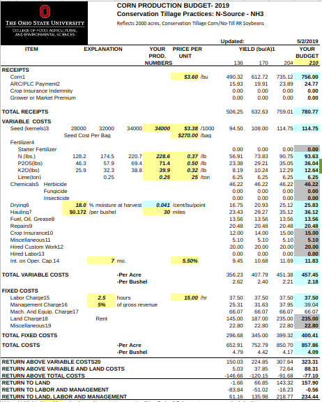
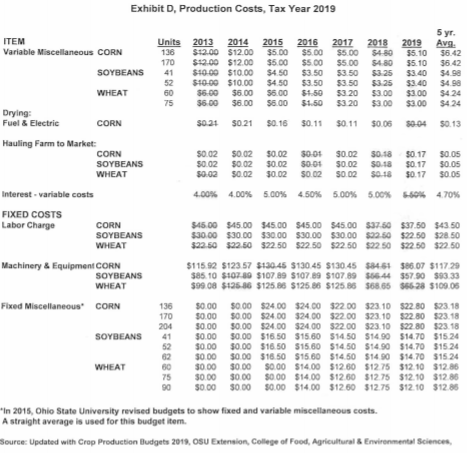

```{r setup, include=FALSE}
library("knitr")
library("kableExtra")
library("lubridate")
library("scales")
library("tidyverse")
opts_chunk$set(echo = TRUE, message = FALSE, echo = FALSE, message = FALSE, warning = FALSE, out.width = "99%", fig.pos = "H")

cauv_indx <- read_csv("../0-data/offline/cauv_index_avg.csv") %>% 
  mutate_at(vars(-year), dollar) %>% 
  select(-num_soils)

# Add in the data
nonland_alt   <- read_rds("../2-calc/nonland/ohio_alternate_nonland.rds")
rot_alt       <- read_rds("../2-calc/rot/ohio_alternate_rotate.rds")
yield_alt     <- read_rds("../2-calc/yields/ohio_alternate_crops.rds")
cap_rates_raw <- read_csv("../0-data/cap_rate/capitalization_rate_alt.csv")
cap_rates_alt <- read_rds("../2-calc/cap/ohio_alternate_caprate.rds")
```

\doublespacing

# Current Agricultural Use Value Background

In 1974, Ohio enacted the Current Agricultural Use Value Program (CAUV) as a property tax incentive for farmers to continue agricultural production on their land instead of developing it due to urbanization pressure. The program also provides a public good by preserving farmland and/or open space. Programs for assessing agricultural land at different values and/or rates is not unique to Ohio as all states have some form of differential tax treatment for agricultural land. Use-value assessment of agricultural land began with Maryland in 1960 while the last state to adopt a program was Wisconsin in 1995 -- Ohio was the 27th state to adopt [@anderson2014use]. States differ in their process for assessing agricultural land at their potential use-value which take the form of roughly three approaches:

1. A percentage reduction from fair market value (e.g., Georgia, Minnesota, and Mississippi)
2. Capitalization of average cash rental rate (e.g., California, Tennessee, and Virginia)
3. Capitalization of net income approach (e.g., Illinois, Iowa, and Pennsylvania)

Some states combine the capitalization of average cash rental rate and net income approach (e.g., Kentucky, Indiana, and North Carolina). In Ohio, valuation of agricultural land enrolled in CAUV is through the capitalization of net income approach which approximates a soil's agricultural capabilities rather than the market value of land:

> Current agricultural use values for taxing farmland are determined by calculating the farm's projected gross income from agricultural production, subtracting projected non-land production costs to get the farm's net income, then dividing this by an adjusted capitalization rate to arrive at the farmland's agricultural worth [@jeffers1999current].

The origins of the CAUV calculations began in the late 1970s as a way to approximate the net income derived from agricultural production and further capitalized by the effective interest on farmland loans [@duvick1978alternative]. Data issues preclude knowing the net income of a farm and instead it must be estimated through expected yields and prices for typical crops for a soil type and its associated non-land costs. Based partially on the finding of @reiss1969cash that a direct correlation between soil productivity and net rents earned by Illinois farmland owners exists, the CAUV program uses soil type to determine the expected yields and this serves the basis for CAUV values. @shaudys1981development described the tenets of implementing a program like CAUV for Ohio:

> Basic elements for effectively implementing and administering any taxation system include: 1) administrative simplicity, 2) ease of understanding, and 3) acceptable administrative costs. An acceptable real property taxation system must be easily understood by both county administrators and taxpayers. 

The program was enacted in 1974 and has subsequently grown in complexity. There were 350 soil types in use for the 1981 CAUV values but this has grown to 3,514 soil types as of 2019. Aside from additional soils, the formula has had major changes to how expected yields are handled[^yields] in 2006, altering the process for crop rotations[^rotations] in 2010, changing the dates used for components[^dates] in 2015, and changing the source of equity rates[^equity] in 2017. There may have been subtle changes prior to 2006 as well, however this is hard to detect as there is limited publicly available information on the CAUV formula prior to 2009.

[^yields]: Yields for soil types are based on the 1984 soil survey, which was the last state-wide survey of yields for corn, soybeans, and wheat by soil type across the state. The original 1984 values were used from 1984 until 2005. In 2006, soil types began having an adjustment factor based on the increase in state-wide yields for each crop.
[^rotations]: Prior to 2010, the crop rotation was based off of the slope classification of a soil type and involved corn, soybeans, wheat, and hay. From 2010 onward, hay was dropped from the formula and the rotation percentage was based off of state-wide harvested acreage of corn, soybeans, and wheat.
[^dates]: Dates used for yields, prices, and rotations were brought up two years and the non-land costs were brought up by one year.
[^equity]: Data source for the equity rate portion of the capitalization rate was changed from the Federal Funds Rate to the [equity rate](https://www.ers.usda.gov/data-products/farm-income-and-wealth-statistics/) over the previous 25 years from the USDA-ERS.


# Recommendations for CAUV Calculation

We adopt the same tenets of @shaudys1981development for recommendations to the CAUV formula which would largely simplify calculations, create a more consistent process, and utilize better data sources. None of the recommendations change the fundamental process of determining CAUV values through a net income capitalization approach and these should largely be viewed as technical changes as opposed to any fundamental changes. We want to make it clear that the Ohio Department of Taxation (ODT) is excellent at [explaining the calculation of CAUV](https://www.tax.ohio.gov/real_property/cauv.aspx) and implementing the program. Our recommendations would ease particular burdens on ODT and allow for a simpler explanation of the process.

## Recommendations[^case]

1. Non-Land Costs as an Olympic average of "total costs" less "rent" and "management" from Ohio State University (OSU) crop budgets.
2. Calculate Rotations and Yields with a 7-year Olympic average to maintain consistency with other component calculations.
3. Replace Farm Credit Service as the source for interest rates with a regional survey of agricultural interest rates from a Federal Reserve Bank (Kansas City).
4. Align all data sources to cover the same years.

[^case]: An uppercase Yield, Price, Non-Land Cost, Capitalization Rate refer to the values used in CAUV calculation while a lowercase would refer to a particular years value from a primary data source that is typically fed into CAUV values.

\newpage

# Non-Land Costs

## Current Methodology

[Official ODT explanation for 2019 CAUV calculations for Non-Land Costs](https://www.tax.ohio.gov/Portals/0/personal_property/Explanation2019.pdf):

> Data on crop production costs are used to estimate average non-land production costs. The data are taken from the Ohio Crop Production Budgets prepared by The Ohio State University College of Food, Agricultural and Environmental Sciences for 2013-2019, inclusive. Again, data are collected for the seven-year period and the highest and lowest costs **for each category** are eliminated from the array. Five-year average costs per unit of specific non-land production cost items are computed from the remaining data as shown in Exhibit D (pages 9-10).

OSU releases [crop budgets](https://farmoffice.osu.edu/farm-mgt-tools/farm-budgets) for corn, soybeans, and wheat every growing season. Each year the crop budget provides a _low_, _medium_, and _high_ scenario for cost items based on expected yields for each crop -- the higher yields will increase the variable costs for a crop but do not affect any of the fixed costs. There is a preliminary release typically around the October before a growing season. For instance, the 2020 marketing year for corn was released in October 2019. The values are typically finalized in May for the year in question as the 2019 corn values were finalized on May 2nd of 2019. Figure \@ref(fig:corn-osu-budget) displays the finalized corn crop budget for 2019 for an indication of how many different costs are involved in a crop budget. 

```{r corn-osu-budget, fig.cap = "OSU Crop Budget for Corn in 2019"}

```

ODT records itemized costs for each crop then uses the previous 7 years of data on crop budgets to construct Non-Land Costs (the 2020 Tax Year will use OSU crop budgets from 2014-2020). There were 137 different items in the corn, soybeans, and wheat crop budgets from OSU used in most recent 2019 CAUV calculation. ODT harmonizes each OSU crop budget to then calculate the Olympic average of each item which can be seen in figures \@ref(fig:nonland-odt-1) and \@ref(fig:nonland-odt-2):


```{r nonland-odt-1, fig.cap = "ODT Method as of 2019 Tax Year"}
knitr::include_graphics("offline/nonland-odt-1.png")
```

```{r nonland-odt-2, fig.cap = "ODT Method as of 2019 Tax Year (cont.)"}

```


The only major categories in OSU crop budgets not collected for calculation are "land charge" and "management charge". "Land charge" is rent which is not explicitly paid by a landowner while "management charge" is not collected by a farm operator as this entails the oversight of agricultural production.

ODT uses a combination of _low_ and _medium_ yield scenarios to calculate Non-Land Costs for each crop which is based on two important concepts:

- **Base Cost**: based on the _low_ productivity yields for each crop for the past 7 years (Olympic average) aside from costs related to management and rent
- **Additional Costs**: based on a linear interpolation between the _low_ and _medium_ productivity values from the past 7 years for each component (Olympic average) aside from costs related to management and rent. This is further divided by the yield difference in the Olympic average of _low_ and _medium_ to put this into per bushel units

Once both the base and additional costs for a particular year are determined, these are fed into the CAUV formula for soils. Every soil type ($s$) has an underlying Yield in their CAUV calculation for a particular Tax Year ($t$):

$$ {Nonland}_{s,t} = {Base}_{t} + \left( {Yield}_{s,t} - {low}_{t} \right) \times {Add}_{t}  $$

A Yield value above (below) the _low_ scenario yield would have Additional Costs multiplied by the difference and added (subtracted) from Base Costs for its Non-Land Costs. However, a Yield value equal to the _low_ scenario in a budget would only have Base Costs for its Non-Land Costs as there would be no corresponding additional cost.


## Potential Issues

The current process lends itself to a few potential issues. The largest issue is the cumbersome processes of manually entering all 137 items from OSU crop budgets as this process cannot be automated. This large of a number of data entry items can lead to typos and the corresponding Olympic averaging of all these components can further increased the likelihood of typos, copy errors, or coding issues.

A further issue is that this process is not well equipped for changes in how the OSU crop budgets are constructed. For instance, the "fixed miscellaneous" and "variable miscellaneous" categories were created in 2015 and thus have no comparable years to form an Olympic average for. In addition, the "hired custom work" category was created in 2018 from a subset of the "mach. and equip. charge" category. Should the splitting of a category be handled by combining the categories back together? And how does one perform a seven year Olympic average on a category that has only existed for a few years? The current method is to take simple averages of the miscellaneous categories until there are enough observations and to reconstruct the "mach. and equip. charge" category by adding in "hired custom work".

And finally as a statistical point, the more individual items which are averaged will increase the overall variance in an outcome. Or in other words, the Non-Land Cost becomes more variable with the more data items that are averaged. As more data items are added to the Non-Land Costs calculation, there more that category will vary from year to year and CAUV values become less stable because of this.

# Non-Land Costs Proposed Change

1. Non-Land Costs as an Olympic average of "total costs" less "land charge" and "management charge" from OSU Budgets as opposed to each individual component having an Olympic average and then summed up.

The process for this proposed change would be that each year the _low_ and _medium_ yield values are recorded along with the _low_ and _medium_ values of "total costs", "land rent", and "management charge" for each crop. Figure \@ref(fig:corn-osu-budget-2019-alt) highlights the 8 relevant numbers to be recorded are circled.

```{r corn-osu-budget-2019-alt, fig.cap = "Relevant Aspects of Crop Budget"}
knitr::include_graphics("offline/corn-osu-budget-2019-alt-red.png")
```

The relevant Non-Land Cost is "total costs" - "land rent" - "management charge" which would have a value for both _low_ and _medium_ for each year and a seven year Olympic average is ultimately used in the CAUV calculation. To be clearer, this process would not take an Olympic average of "total costs", "land rent", and/or "management charge" but instead the Olympic average is for the value of "total costs" - "land rent" - "management charge". The **Base Cost** would continue to be the Olympic average of the _low_ value while the **Additional Cost** would also be the linear interpolation between the _low_ and _medium_ per bushel values as before.

The main reasons for this proposed change are threefold. For one, this method is easier to implement than manually recording 137 data items which will cut down on tedious work and reduce the potential for typos. Along with the ease of implementation is that it is a simpler method for understanding the process of constructing a Non-Land Cost than listing so many different items which go into the Non-Land Costs. It is synonymous to say that Non-Land Costs are constructed by total cost on the land less rent and management versus stating that costs include seed, fertilizer, machinery, etc.

The second reason is that this method will safeguard against any potential changes that might happen to the structure or definition of OSU crop budgets. Throughout the entire history of CAUV, there have only been two costs omitted from the formula in the form of rent and management charges as these are essential functions to owning property. On the other hand, the cost categories which are not rent or management charges have gone through substantial changes and, while it infrequently occurs, a category may have substantial change from one year to the next.

And finally, this process will have more stable Non-Land Cost values because there are fewer components involved in calculating the final output. Within a given year, there is correlation across cost items which makes individual items more variable than the overall total costs from year to year. By constructing an item-by-item Olympic average, the overall variance in an outcome will be larger than if only total costs was Olympic averaged. With the recommended change, the Non-Land Costs become more stable from year to year.

## Hypothetical Values

Hypothetical Non-Land Costs for all of the crops are provided to give a sense of how much this new process would change from the current calculations. Table  \@ref(tab:nonland-corn) provides values for corn, table \@ref(tab:nonland-soy) provides values for soybeans, and table \@ref(tab:nonland-wheat) provides values for wheat. The ultimate effect on CAUV values in comparison to the current methodology are further provided in table \@ref(tab:rec-nonland).

The difference in **Base Costs** for all commodities under the proposed change are all less than 5\% in magnitude although most of the yearly differences are around the 1.5\% magnitude. For corn, the base costs under the proposed change are generally slightly higher although this depends on the year as 2015--2017 the **Base Costs** are actually lower. For soybeans and wheat, their differences in magnitude are approximately the same and trend in the same direction for **Base Costs** in that they would be higher for the pre-2014 period but lower for the post-2016 period. From a **Base Costs** perspective moving forward, the proposed change would generally have higher for corn and lower for soybeans and wheat for a fairly neutral effect on CAUV from this perspective.

For **Additional Costs**, the most recent hypothetical values are close to the current method for CAUV valuation with corn as identical and soybeans and wheat within 5\% of the current values. However, the pre-2017 values for additional costs have a fairly wide disparity with corn values typically being higher, soybean values consistently more than 10\% higher, and wheat values consistently around 18\% lower. The **Additional Costs** category will only affect soil types which are at the high or low distribution of yields for a given commodity, so the effects are a bit difficult to pick up especially if one only looks at the mean value of CAUV. However, the actual mix of high/low values generally have a dampened effect overall since the magnitudes are similar.

The ultimate effect on CAUV values (seen in table \@ref(tab:rec-nonland)) would keep CAUV values to be roughly similar to the actual values. Pre-2015 CAUV values would be lower than realized values while post-2015 would be slightly higher, however the magnitudes are relatively small. One culprit of this discrepancy is that the "miscellaneous" category was formed in 2015 and has only been a simple average of its values which in turn affects the costs under the current valuation method.


```{r nonland-corn}
nonland_alt %>% 
  filter(year > 2011, !is.na(corn_cost_odt)) %>% 
  mutate(base = dollar(corn_cost_odt),
         base_alt = dollar(corn_cost_alt),
         base_diff = percent((corn_cost_alt - corn_cost_odt) / corn_cost_odt),
         
         add = dollar(corn_cost_add_odt),
         add_alt = dollar(corn_cost_add_alt),
         add_diff = percent((corn_cost_add_alt - corn_cost_add_odt) / corn_cost_add_odt)) %>% 
  select(Year = year, "ODT Base" = base, "Alt Base" = base_alt, "Diff Base" = base_diff,
         "ODT Add" = add, "Alt Add" = add_alt, "Diff Add" = add_diff) %>% 
  kable(booktabs = T, caption = "Hypothetical Previous Values for Corn") %>% 
  kable_styling(latex_options = c("scale_down", "HOLD_position"))
  
```


```{r nonland-soy}
nonland_alt %>% 
  filter(year > 2011, !is.na(soy_cost_odt)) %>% 
  mutate(base = dollar(soy_cost_odt),
         base_alt = dollar(soy_cost_alt),
         base_diff = percent((soy_cost_alt - soy_cost_odt) / soy_cost_odt),
         
         add = dollar(soy_cost_add_odt),
         add_alt = dollar(soy_cost_add_alt),
         add_diff = percent((soy_cost_add_alt - soy_cost_add_odt) / soy_cost_add_odt)) %>% 
  select(Year = year, "ODT Base" = base, "Alt Base" = base_alt, "Diff Base" = base_diff,
         "ODT Add" = add, "Alt Add" = add_alt, "Diff Add" = add_diff) %>% 
  kable(booktabs = T, caption = "Hypothetical Previous Values for Soybeans") %>% 
  kable_styling(latex_options = c("scale_down", "HOLD_position"))
  
```


```{r nonland-wheat}
nonland_alt %>% 
  filter(year > 2011, !is.na(wheat_cost_odt)) %>% 
  mutate(base = dollar(wheat_cost_odt),
         base_alt = dollar(wheat_cost_alt),
         base_diff = percent((wheat_cost_alt - wheat_cost_odt) / wheat_cost_odt),
         
         add = dollar(wheat_cost_add_odt),
         add_alt = dollar(wheat_cost_add_alt),
         add_diff = percent((wheat_cost_add_alt - wheat_cost_add_odt) / wheat_cost_add_odt)) %>% 
  select(Year = year, "ODT Base" = base, "Alt Base" = base_alt, "Diff Base" = base_diff,
         "ODT Add" = add, "Alt Add" = add_alt, "Diff Add" = add_diff) %>% 
  kable(booktabs = T, caption = "Hypothetical Previous Values for Wheat")  %>% 
  kable_styling(latex_options = c("scale_down", "HOLD_position"))
  
```


```{r rec-nonland}
read_rds("../3-proj/recommendations/ohio_nonland_alt.rds") %>% 
  filter(year > 2011, year < 2020) %>% 
  left_join(select(cauv_indx, year, official_avg = avg_cauv)) %>% 
  mutate(pct = percent((parse_number(avg_cauv) - parse_number(official_avg)) / parse_number(official_avg), accuracy = 0.1)) %>% 
  select(Year = year, "Avg CAUV" = official_avg, "Alt Avg CAUV" = avg_cauv, "Pct Chg" = pct, everything()) %>% 
  kable(booktabs = T, caption = "Hypothetical Previous CAUV Values") %>% 
  kable_styling(latex_options = c("scale_down", "HOLD_position"))
```

\newpage

# Rotations and Yields

## Current Methodology

[Official explanation of 2019 CAUV Calculations for Rotations](https://www.tax.ohio.gov/Portals/0/personal_property/Explanation2019.pdf):

> The cropping pattern for each map unit is assigned a rotation based on the most recent five year average of crop acres harvested in Ohio: 38\% corn, 56\% beans, and 6\% wheat. This rotation is based on data from 2014-2018 and closely reflects current agricultural production in Ohio. The acres harvested in each year are shown in Exhibit B (page 7).

[Official explanation of 2019 CAUV Calculations for Yields](https://www.tax.ohio.gov/Portals/0/personal_property/Explanation2019.pdf):

> For each of the soil mapping units, data regarding typical yields of each of the major field crops (corn, soybeans and wheat) were last published in 1984. In order to reflect more accurate yields, those yields of record have been updated annually since 2006. The yields are updated by a factor based on ten years of statewide yield information published by USDA. For 2019, yield data from calendar years 2009-2018 were averaged and divided by the 1984 yield for each crop (Exhibit A, page 6). This factor is applied to the 1984 crop yield of record for each soil. The table below shows the average yields used to develop the factor for each of the crops.

The process for constructing both Rotations and Yields is more straight-forward than the Non-Land costs as there is only one data source for each and only one data item to average. For both Rotations and Yields, data come from [Crop Production Reports](https://usda.mannlib.cornell.edu/MannUsda/viewDocumentInfo.do?documentID=1046) and the values are typically finalized in January of the following year although there are situations where the USDA will retroactively adjust these official values in light of new data such as the Agricultural Census.

Rotations use the harvested acreage information for the state. The value of Rotations in the CAUV formula currently uses a 5 year simple average. The current procedure of calculating rotations began in the 2010 tax year when hay was dropped from the CAUV formula. Prior to 2010, the rotations were set based on an ad hoc procedure based on the slope of category of a soil type as seen in figure \@ref(fig:ad-hoc-rotations). It is unclear why the 5-year average was chosen for rotation procedures in 2010 instead of the typical 7-year Olympic average that the other components use.

```{r ad-hoc-rotations, fig.cap = "Pre-2010 Crop Rotations"}

```

Yields use the harvested yields for the state and currently uses a 10 year simple average in the CAUV formula. Prior to 2006, there was no adjustment factor for Yields and the 1984 value of Yield was used in CAUV calculation. Because CAUV values are based on soil types and the most recent comprehensive soil survey in the state is from 1984, the CAUV formula adjusts by state-wide increase in yields to better approximate the expected yields of corn, soybeans, and wheat for a particular soil type. It is unclear why a 10-year average was chosen for this adjustment factor in 2006 instead of the typical 7-year Olympic average that the other components use.


## Potential Issues

The Rotations and Yields are the only components in the CAUV formula which do not have an Olympic averaging component nor 7 years of data (excluding the legislated mandate of an Equity yield rate of a 25-year average of the "total rate of return on farm equity" published by USDA [Economic Research Service](https://data.ers.usda.gov/reports.aspx?ID=17835)). This is of potential concern because of the tediousness of recalling the different years of data used in the calculation as opposed to having a consistent method across all CAUV components. The Olympic average is a beneficial aspect of averaging because it will reduce the influence of outliers that may occur due to natural disasters or uncontrollable aspects in agriculture. Further, the CAUV formula was originally intended to approximate the net income on a farm in previous years because of lack of data on net income. Having more (or fewer) years in calculating components in the CAUV formula places less (more) emphasis on recent trends in agriculture and in relation to other components.


# Rotations and Yields Proposed Change


2. Calculate Rotations and Yields with a 7-year Olympic average

The reasoning behind this proposed change is fairly straight-forward in that the calculations for CAUV will be more consistent across components. There is a further benefit that outliers of high/low harvested acreage and/or yields will be removed from the formula and provides more stability in overall CAUV values from year to year.

The overall effect on how Rotations would change is a slower adjustment for year-to-year fluctuations in crop rotations as seen in table \@ref(tab:rotation-proposed). In the early 2010s, there is a slight skew towards soybeans and away from corn while the later 2010s this trend reverses towards corn. Because the typical net income across corn, soybeans, and wheat are usually similar for each year and the changes in Rotation percentage is small, there is little effect on CAUV values. The overall effect on hypothetical CAUV values, as seen in table \@ref(tab:rec-rot), is extremely similar CAUV values to the current method. 

For the effect on Yields, the reduction from a 10-year average to a 7-year Olympic average would be a general increase in the adjustment factor for Yield since yields typically follow a linear trend over time -- fewer years used in an average of an upward trending variable will lead to a higher value. Because of this, the new hypothetical Yields, as seen in table \@ref(tab:yield-proposed), are generally higher or unaffected. There is an up to a 5\% increase in corn Yield, up to a 9\% increase in soybean Yield, and an up to a 3\% increase in wheat Yield. However, these Yield adjustments are intertwined with the **Additional Costs** as Yields not only affect what would represent the revenues of a crop but also the costs. For our projections of hypothetical changes in CAUV values, we assume that the proposed Non-Land Costs adjustments have not been adopted as seen in table \@ref(tab:rec-yields). The overall effect on CAUV values with the proposed change would to have higher values upwards of a 23\% increase although more typically around a 13\% increase in CAUV values.

Combining both of these proposals for hypothetical CAUV values largely produces the results seen in the effect on Yields as can be seen in table \@ref(tab:rec-rot-yield). The previous years would have had at most a 23\% increase in CAUV values but the most recent 2019 CAUV values would be about 10\% higher on average. 


## Hypothetical CAUV Values


```{r rotation-proposed}
rot_alt %>% 
  filter(year > 2009, year < 2020) %>% 
  mutate(corn_rotate_alt = scales::percent(corn_rotate_alt, accuracy = 0.1),
         corn_rotate_odt = scales::percent(corn_rotate_odt, accuracy = 0.1),
         soy_rotate_alt = scales::percent(soy_rotate_alt, accuracy = 0.1),
         soy_rotate_odt = scales::percent(soy_rotate_odt, accuracy = 0.1),
         wheat_rotate_alt = scales::percent(wheat_rotate_alt, accuracy = 0.1),
         wheat_rotate_odt = scales::percent(wheat_rotate_odt, accuracy = 0.1)) %>% 
  select("Year" = year,
         "ODT Corn" = corn_rotate_odt,
         "Alt Corn" = corn_rotate_alt,
         "ODT Soybeans" = soy_rotate_odt,
         "Alt Soybeans" = soy_rotate_alt,
         "ODT Wheat" = wheat_rotate_odt,
         "Alt Wheat" = wheat_rotate_alt) %>% 
  kable(booktabs = T, caption = "Proposed Change Effect on Rotations") %>% 
  kable_styling(latex_options = c("scale_down", "HOLD_position"))
```


```{r rec-rot}
read_rds("../3-proj/recommendations/ohio_rot_alt.rds") %>% 
  filter(year > 2009, year < 2020) %>% 
  left_join(select(cauv_indx, year, official_avg = avg_cauv)) %>% 
  mutate(pct = percent((parse_number(avg_cauv) - parse_number(official_avg)) / parse_number(official_avg), accuracy = 0.1)) %>% 
  select(Year = year, "Avg CAUV" = official_avg, "Alt Avg CAUV" = avg_cauv, "Pct Chg" = pct, everything()) %>% 
  kable(booktabs = T, caption = "Hypothetical CAUV Values for Rotations") %>% 
  kable_styling(latex_options = c("scale_down", "HOLD_position"))
```


```{r yield-proposed}
yield_alt %>% 
  filter(year > 2009, !is.na(corn_yield_odt)) %>% 
  mutate_if(is.numeric, ~round(., digits = 1)) %>% 
  mutate(corn_diff = percent((corn_yield_alt - corn_yield_odt) / corn_yield_odt, accuracy = 0.1),
         soy_diff = percent((soy_yield_alt - soy_yield_odt) / soy_yield_odt, accuracy = 0.1),
         wheat_diff = percent((wheat_yield_alt - wheat_yield_odt) / wheat_yield_odt, accuracy = 0.1)) %>% 
  select("Year" = year,
         "ODT Corn" = corn_yield_odt,
         "Alt Corn" = corn_yield_alt,
         "Corn Diff" = corn_diff,
         "ODT Soybeans" = soy_yield_odt,
         "Alt Soybeans" = soy_yield_alt,
         "Soybeans Diff" = soy_diff,
         "ODT Wheat" = wheat_yield_odt,
         "Alt Wheat" = wheat_yield_alt,
         "Wheat Diff" = wheat_diff) %>% 
  kable(booktabs = T, caption = "Proposed Change Effect on Yields") %>% 
  kable_styling(latex_options = c("scale_down", "HOLD_position"))
```


```{r rec-yields}
read_rds("../3-proj/recommendations/ohio_yield_alt.rds") %>% 
  filter(year > 2009, year < 2020) %>% 
  left_join(select(cauv_indx, year, official_avg = avg_cauv)) %>% 
  mutate(pct = percent((parse_number(avg_cauv) - parse_number(official_avg)) / parse_number(official_avg), accuracy = 0.1)) %>% 
  select(Year = year, "Avg CAUV" = official_avg, "Alt Avg CAUV" = avg_cauv, "Pct Chg" = pct, everything()) %>% 
  kable(booktabs = T, caption = "Hypothetical CAUV Values for Yields") %>% 
  kable_styling(latex_options = c("scale_down", "HOLD_position"))
```


```{r rec-rot-yield}
read_rds("../3-proj/recommendations/ohio_rot_yield_alt.rds") %>% 
  filter(year > 2009, year < 2020) %>% 
  left_join(select(cauv_indx, year, official_avg = avg_cauv)) %>% 
  mutate(pct = percent((parse_number(avg_cauv) - parse_number(official_avg)) / parse_number(official_avg), accuracy = 0.1)) %>% 
  select(Year = year, "Avg CAUV" = official_avg, "Alt Avg CAUV" = avg_cauv, "Pct Chg" = pct, everything()) %>% 
  kable(booktabs = T, caption = "Hypothetical CAUV Values for Rotations and Yields") %>% 
  kable_styling(latex_options = c("scale_down", "HOLD_position"))
```


\newpage

# Capitalization Rate

## Current Methodology

- [Explanation of 2019 CAUV Calculations for Capitalization Rate](https://www.tax.ohio.gov/Portals/0/personal_property/Explanation2019.pdf):

> **Five-year averaging is used to derive the Farm Credit Service interest rate of 5.69\% assuming an 80\% loan for a 25-year term, payable annually** (Exhibit E, page 14). The interest rate of 7.55\% for the 20 percent equity portion is based on the 25-year average of the "total rate of return on farm equity" published by USDA (1993-2017, inclusive). (RC. 5715.01) 
>
> The capitalization rate for typical Ohio farmland is computed by the mortgage-equity method. The statewide average effective tax rate after application of the reduction factors levied on agricultural property is 49.94 mills for tax year 2018 (R.C. 319.301 ). The 9.0 percent nonbusiness credit rollback authorized by R.C. 319.302 reduces this rate further to 45.44 mills. As a percent of market value, the effective tax rate to be used in this year's capitalization formula is 1.6\%, (.35 x 45.44)/1000. 

The Capitalization Rate is quite possibly the most influential component of the entire CAUV formula as it is in the denominator of the formula and is typically a value less than 10\% (${CAUV} = \frac{Net Income}{Cap Rate}$). Additionally, the calculation of the Capitalization Rate is the most involved and complex although only the interest rate and equity rate are data which need to be acquired outside of ODT for the formula.

The Capitalization Rate requires the knowledge of an interest rate on a loan and an equity rate as well as the term and debt percentage for determining from the [Mortgage-Equity Method](http://www.commercialappraisalsoftware.dcfsoftware.com/mtgequity.htm). Figure \@ref(fig:interest-rates-odt) displays the values of interest rate and equity rate for the 2019 CAUV values.

```{r interest-rates-odt, fig.cap = "Interest Rates Current Calculation"}
knitr::include_graphics("offline/interest-rates-odt.png")
```

For a mathematical representation and description of the Capitalization Rate, we can define the Capitalization Rate as:

$$\begin{aligned}
{CAP_t} &= {Loan \%}_t \times {Annual Debt Service}_t + \\
& {Equity \%}_t \times {Equity Yield}_t - \nonumber \\
& {Buildup}_t + \nonumber \\
& {Tax Additur Adjustment}_t \nonumber
\end{aligned}$$


The ${Loan \%}_t$ plus ${Equity \%}_t$ must equal one and is currently an 80% to 20% ratio respectively. Prior to 2015, the values were based on 60% loan and 40% equity appreciation. 
${Annual Debt Service}_t$ is a debt servicing factor based on a 25-year term mortgage with an associated interest rate. The interest rate used for a particular year is based on a 7-year Olympic average where the value for the loan interest rate came from a 25-year mortgage from Farm Credit Services (FCS). Prior to 2015, a 15-year term was used instead of 25 and there were no lags in this formula. For example, the 2017 interest rate used comes from FCS values between 2011 and 2017. The formula for calculating the debt servicing factor with $r$ as the interest rate (from FCS) and $n$ the term length (currently 25) is:

$$ {Annual Debt Service} = \frac{r \times (1 + r)^n}{(1 + r)^n - 1} $$

Next, the ${Equity Yield}_t$ needs to be calculated -- which is simply the interest rate associated with equity that a farmer may hold. Prior to 2017, the equity yield was a 7-year Olympic average of the prime rate plus 2% from the Wall Street Journal's bank survey -- with no lag for the values. In 2017, the ODT switched the equity yield to be a two year lagged 25-year average of the "Total rate of return on farm equity" from the [Economic Research Services](https://data.ers.usda.gov/reports.aspx?ID=17838) of the USDA. For example, the 2017 value used the ERS's values from 1991 to 2015.

Then, the equity buildup associated with a set time frame needs to be calculated. The equity buildup formula involves an associated interest rate (the ${Equity Yield}_t$ is used here as $r$) and a time-frame $n$, which is set at 25 years currently (prior to 2017, this was set at 5 years of equity buildup):

$$ {Buildup}_t = {Equity \%}_t \times {Mortgage Paid \%}_t \times \frac{r}{(1 + r)^n - 1} $$

For 2017 and beyond, the ${Mortgage Paid \%}_t$ is assumed to be 100%. However, prior to 2017 this value needed to be calculated as the percentage of mortgage paid after 5 years. The mortgage term was needed to determine what the mortgage paid after 5 years would be. For 2015 and beyond the mortgage terms have been for 25 years while prior to 2015 the mortgage term was for 15 years. The formula for calculating the percentage of the mortgage paid off after 5 years is:

$$ {Mortgage Paid \%}_t = \frac{ \frac{1}{ (1 + r)^{n-5} } - \frac{1}{ (1 + r)^n} }{ 1 - \frac{1}{(1 + r)^n} } $$

Where $r$ is the interest rate and $n$ is the term of the loan.

<!--- in addition, --->

And finally, the ${Tax Additur Adjustment}_t$ needs to be calculated. The tax additur is added onto the capitalization rate as a way to proxy for property taxes as a ratio to market value. The statewide average effective tax rate on agricultural land, as determined through table [DTE27](https://www.tax.ohio.gov/tax_analysis/tax_data_series/publications_tds_property.aspx#Allpropertytaxes), from the previous tax year is used in calculation for the tax additur in question. The statewide average effective tax rate is expressed in terms of mills and the tax additur is then expressed as:

$$ {Tax Additur Adjustment}_t = \frac{0.35 \times {Statewide Millage}_{t-1} }{1000} $$

## Potential Issues

The Capitalization Rate formula has been largely unchanged throughout the entirety of the CAUV program as Richard Duvick first proposed using the [Mortgage-Equity Method](http://www.commercialappraisalsoftware.dcfsoftware.com/mtgequity.htm) in 1978 [@duvick1978alternative]. However, the data used for the interest rates has changed over time from the Louisville Federal Land Bank to the current method involving Farm Credit Services (FCS) along with some slight changes in the loan terms.

FCS does not publish quarterly or even annual values for interest rates on real estate loans. Instead, ODT systematically calls an FCS location to request a quoted interest rate on a hypothetical  25-year term loan of \$75,000 at their fixed multi-flex rate. This call occurs on the same day each month and ultimately the monthly interest rates are averaged for the previous year and is the official source for interest rates in the Capitalization Rate. These annual interest rates are then subject to the typical 7-year Olympic average and used in the Capitalization Rate formula for a given Tax Year.

This particular method of calculating an interest rate is problematic for a few reasons. For one, this calculated interest rate is not an official product of a research based agency unlike all other data source used in CAUV calculation. Because the interest rate is not collected by a research based agency there are questions as to whether or not the methodology of constructing a simple average over all the months accurately reflects the typical interest rate faced by a farmer during the year[^legal]. There is also no ability for a third party to verify the historical interest rates as a way to validate the values used in CAUV calculations.

[^legal]: A potential legal question, out of our expertise to answer, is if having a data source which is not endorsed by a research agency opens up the possibility that the state could be sued? For example, it would be difficult for a agricultural landowner to make a claim that corn yields for the state of Ohio in 2018 was anything different than the official USDA estimate of 187 bushels per acre. However, what would be the defense of ODT if an agricultural landowner claimed FCS charged 7\% on average for real estate loans in 2019 than the 6\% used in CAUV calculations?

# Capitalization Rate Proposed Change


3. Replace Farm Credit Service as the source for interest rates with a regional survey of agricultural interest rates from a Federal Reserve Bank (values would be from first quarter of the year in question)

Using a research based agency as the source of interest rate data reduces the data collection burden on ODT and allows for an independent verification procedure of CAUV values to be performed. The Kansas City Federal Reserve Bank provides the [Agricultural Finance Book](https://www.kansascityfed.org/research/indicatorsdata/agfinancedatabook) which is released every January that compiles agricultural data collected across all Federal Reserve Districts and provides a written overview of the economic conditions in agriculture. The book is typically released every quarter although in 2019 there were only two releases (January and July). Within the databook, sheet "afdr_c4" provides quarterly values of long-term real estate interest rates for Federal Reserve Districts that conduct an agricultural credit survey. These agricultural credit surveys provide a verifiable value for interest rates which are [publicly available](https://www.kansascityfed.org/research/indicatorsdata/agcreditsurvey). Figure \@ref(fig:DistrictMap) displays all of the 12 Federal Reserve Districts across the United States although not all of them conduct surveys of agricultural credit conditions.

```{r DistrictMap, fig.cap = "Federal Reserve Districts"}
knitr::include_graphics("offline/DistrictMap.png")
```

Ohio is completely within the Cleveland District, however the Cleveland District does not conduct an agricultural credit survey as their main area of economic research within its region is manufacturing. The Districts that do conduct agricultural credit surveys are Chicago, Kansas City, Minneapolis, San Francisco, Dallas, Richmond, and St. Louis. The Chicago District is the closest geographically and has maintained an agricultural credit survey since 1991 which is tied for the longest on record along with the Dallas District. In comparison to the publicly available FCS values for yearly interest rates[^not] based on FCS loans, the surveyed interest rates on agricultural real estate loans as seen in figure \@ref(fig:interest-rates-line) (the raw values are also displayed in table \@ref(tab:interest-rates)). Interestingly enough, the Chicago District typically has the lowest reported interest rates on real estate loans each quarter while the Dallas District typically has the highest reported interest rates each quarter and all Districts appears to be ordered in approximately the same rank each quarter. However, the ODT value fluctuates wildly from having one of the highest values in 2009, 2010, 2014, and 2018 while having the lowest recorded value for 2012. These large swings in recorded interest rates from FCS data relative to quarterly surveys in real estate loan interest rates across Federal Reserve Districts is an argument to move away from the current method of using FCS data and instead adopt a District for the data source of interest rates. The 7-year Olympic averages for each of the Federal Reserve Districts are also provided in table \@ref(tab:interest-rates-olympic).

[^not]: These interest are not to be confused with the the 7-year Olympic value used in the CAUV calculation.


```{r interest-rates-line, fig.cap = "Interest Rates Proposed"}
cap_rates_raw %>% 
  # filter(month(date) == 3) %>% 
  select(date, # "FCS (ODT)" = interest_rate_25_odt,
         Chicago = chicago_fed_re, "Kansas City" = kansascity_fed_re,
         Minneapolis = minneapolis_fed_re, "San Francisco" = sanfrancisco_fed_re,
         Dallas = dallas_fed_re, Richmond = richmond_fed_re,
         "St. Louis" = stlouis_fed_re) %>% 
  gather(var, val, -date) %>% 
  ggplot(aes(date, val, color = var, linetype = var)) +
    geom_line(data = cap_rates_raw %>% filter(month(date) == 3) %>% select(date, interest_rate_25_odt),
            aes(x = date, y = interest_rate_25_odt,
                linetype = NULL, color = NULL), size = 2) +
  geom_line() +
  scale_y_continuous(labels = scales::percent) +
  theme_minimal() +
  theme(legend.position = "bottom") +
  labs(x = "", y = "", color = "Federal Reserve \nDistrict",
       linetype = "Federal Reserve \nDistrict",
       subtitle = "ODT value bolded in black") +
  guides(linetype = guide_legend(override.aes = list(size = 0.5)),
         color = guide_legend(override.aes = list(size = 0.5)))
```

```{r interest-rates}
cap_rates_raw %>% 
  filter(month(date) == 3, year > 2008) %>% 
  select(Year = year, "FCS (ODT)" = interest_rate_25_odt,
         Chicago = chicago_fed_re, "Kansas City" = kansascity_fed_re,
         Minneapolis = minneapolis_fed_re, "San Francisco" = sanfrancisco_fed_re,
         Dallas = dallas_fed_re, Richmond = richmond_fed_re,
         "St. Louis" = stlouis_fed_re) %>% 
  mutate_at(vars(-Year), ~scales::percent(., accuracy = 0.1)) %>% 
  kable(booktabs = T, caption = "Interest Rates Proposed (Raw Values)") %>% 
  kable_styling(latex_options = c("scale_down", "HOLD_position"))
```


```{r interest-rates-olympic}
cap_rates_alt %>% 
  filter(year > 2008, !is.na(interest_rate_odt)) %>% 
  select(Year = year, "FCS (ODT)" = interest_rate_odt,
         Chicago = chicago_fed_re, "Kansas City" = kansas_fed_re,
         Dallas = dallas_fed_re) %>% 
  mutate_at(vars(-Year), ~scales::percent(., accuracy = 0.01)) %>% 
  kable(booktabs = T, caption = "Interest Rates Proposed (Olympic Average)") %>% 
  kable_styling(latex_options = c("scale_down", "HOLD_position"))
  
```

In evaluating which District would best meet the needs for the interest rate in the CAUV formula, we will proceed with Chicago, Dallas and Kansas City. Chicago and Dallas are chosen because they are consistently the highest and lowest real estate interest rates which would provide bounds for hypothetical CAUV values. The Kansas City District is chosen for a few reasons. For one, the Federal Reserve Bank of Kansas City is the leading agricultural research institute within the Federal Reserve System as evidenced by their Ag Finance Databook which collects all of the data from agricultural credit surveys across the Federal Reserve. Another reason is that the primary crops produced within Kansas and much of the rest of the district is wheat, corn, and soybeans which largely mimics Ohio. And finally, the Kansas City District real estate interest rates are typically around the median value across all of the reported agricultural credit surveys. Because of all these reasons surrounding the Kansas City District, we suggest ODT would adopt this particular agricultural credit survey.


## Hypothetical Values

While there may appear to be a significant difference across the interest rates from agricultural credit surveys, the interest rate is only one component for the Capitalization Rate. Because of the current 80-20 loan to equity ratio, the equity rate still contributes a fair amount towards the Capitalization Rate and the actual impacts on the Capitalization are more muted as seen in table \@ref(tab:cap-rate-proposed). In calculating these values, we used the Capitalization Rate method that was in place during the Tax Year in question which would imply assumed loan terms from the mortgage-equity which had a sinking time of 5 years prior to 2017 as well as a 60-40 loan to equity ratio and 15 year loan term prior to 2015.

```{r cap-rate-proposed}
cap_rates_alt %>% 
  filter(year > 2008, !is.na(cap_rate_odt)) %>% 
  select("Year" = year, "ODT Value" = cap_rate_odt,
         "Dallas" = cap_rate_dallas,
         "Kansas City" = cap_rate_kansas,
         "Chicago" = cap_rate_chicago) %>% 
  mutate_at(vars(-Year), ~scales::percent(., accuracy = 0.1)) %>% 
  kable(booktabs = T, caption = "Capitalization Rate Proposed") %>% 
  kable_styling(latex_options = c("scale_down", "HOLD_position"))
```

The Chicago District interest rates would be lower than the current ODT values for every year aside from 2013-2017. For Chicago, table \@ref(tab:rec-chicago) indicates that the ultimate difference for CAUV values would somewhere between 2\% higher and 4\% lower average CAUV values. The Dallas District interest rates consistently would have higher Capitalization Rate values throughout the time period of around half a percentage point. For Dallas, table \@ref(tab:rec-dallas) indicates that the ultimate difference for CAUV values would somewhere between 3\% and 11\% lower average CAUV values. And the Kansas City District also had higher Capitalization Rates throughout the entire period but with a difference that narrowed to around 0.1\% in the 2019 Tax Year. For Kansas City, table \@ref(tab:rec-kansas) indicates that the ultimate difference for CAUV values would somewhere between 1\% and 7\% lower average CAUV values. 


```{r rec-chicago}
read_rds("../3-proj/recommendations/ohio_cap_chicago.rds") %>% 
  filter(year > 2009, year < 2020) %>% 
  left_join(select(cauv_indx, year, official_avg = avg_cauv)) %>% 
  mutate(pct = percent((parse_number(avg_cauv) - parse_number(official_avg)) / parse_number(official_avg), accuracy = 0.1)) %>% 
  select(Year = year, "Avg CAUV" = official_avg, "Alt Avg CAUV" = avg_cauv, "Pct Chg" = pct, everything()) %>% 
  kable(booktabs = T, caption = "Hypothetical CAUV Values from Chicago Capitalization Rate") %>% 
  kable_styling(latex_options = c("scale_down", "HOLD_position"))
```


```{r rec-dallas}
read_rds("../3-proj/recommendations/ohio_cap_dallas.rds") %>% 
  filter(year > 2009, year < 2020) %>% 
  left_join(select(cauv_indx, year, official_avg = avg_cauv)) %>% 
  mutate(pct = percent((parse_number(avg_cauv) - parse_number(official_avg)) / parse_number(official_avg), accuracy = 0.1)) %>% 
  select(Year = year, "Avg CAUV" = official_avg, "Alt Avg CAUV" = avg_cauv, "Pct Chg" = pct, everything()) %>% 
  kable(booktabs = T, caption = "Hypothetical CAUV Values from Dallas Capitalization Rate") %>% 
  kable_styling(latex_options = c("scale_down", "HOLD_position"))
```


```{r rec-kansas}
read_rds("../3-proj/recommendations/ohio_cap_kansas.rds") %>% 
  filter(year > 2009, year < 2020) %>% 
  left_join(select(cauv_indx, year, official_avg = avg_cauv)) %>% 
  mutate(pct = percent((parse_number(avg_cauv) - parse_number(official_avg)) / parse_number(official_avg), accuracy = 0.1)) %>% 
  select(Year = year, "Avg CAUV" = official_avg, "Alt Avg CAUV" = avg_cauv, "Pct Chg" = pct, everything()) %>% 
  kable(booktabs = T, caption = "Hypothetical CAUV Values from Kansas City Capitalization Rate") %>% 
  kable_styling(latex_options = c("scale_down", "HOLD_position"))
```


\newpage

# Data Years Used

## Current Methodology

The current years used for the data sources of the 5 components in CAUV is for the Capitalization Rate and Non-Land Costs to be aligned with the current Tax Year (i.e. there is no lag and 2020 will include the 2020 year values for interest rates and crop budgets) while the Prices, Rotation, and Yields are lagged one year (i.e. Tax Year 2020 will include the 2019 values for acreage, prices, and yields). As far back as I can gather data on the CAUV formula, it has not always been the case as seen in table \@ref(tab:historical). The most substantial change was in 2015 which cut down the lag time for Non-Land Costs, Prices, Rotation, and Yields by two years. These changes were apparently due to the desire to have the most up-to-date available information as that would align with the earliest available USDA or OSU data releases for a given Tax Year.

```{r historical}
read_csv("../4-presentations/offline/historical-dates.csv") %>% 
  select_if(is_character) %>% 
  kable(booktabs = T, caption = "Historical CAUV Data Years Used") %>% 
  kable_styling(latex_options = c("scale_down", "HOLD_position"))
```

<!-- | Tax Year|Capitalization Rate |Yields    |Prices    |Non-Land Costs |Rotation  | -->
<!-- |--------:|:-------------------|:---------|:---------|:--------------|:---------| -->
<!-- |     2005|1999-2005           |1984      |1997-2003 |1998-2004      |ad hoc    | -->
<!-- |     2006|2000-2006           |1995-2004 |1998-2004 |1999-2005      |ad hoc    | -->
<!-- |     2007|2001-2007           |1996-2005 |1999-2005 |2000-2006      |ad hoc    | -->
<!-- |     2008|2002-2008           |1997-2006 |2000-2006 |2001-2007      |ad hoc    | -->
<!-- |     2009|2003-2009           |1998-2007 |2001-2007 |2002-2008      |ad hoc    | -->
<!-- |     2010|2004-2010           |1999-2008 |2002-2008 |2003-2009      |2004-2008 | -->
<!-- |     2011|2005-2011           |2000-2009 |2003-2009 |2004-2010      |2005-2009 | -->
<!-- |     2012|2006-2012           |2001-2010 |2004-2010 |2005-2011      |2006-2010 | -->
<!-- |     2013|2007-2013           |2002-2011 |2005-2011 |2006-2012      |2007-2011 | -->
<!-- |     2014|2008-2014           |2003-2012 |2006-2012 |2007-2013      |2008-2012 | -->
<!-- |     2015|2009-2015           |2005-2014 |2008-2014 |2009-2015      |2010-2014 | -->
<!-- |     2016|2010-2016           |2006-2015 |2009-2015 |2010-2016      |2011-2015 | -->
<!-- |     2017|2011-2017           |2007-2016 |2010-2016 |2011-2017      |2012-2016 | -->
<!-- |     2018|2012-2018           |2008-2017 |2011-2017 |2012-2018      |2013-2017 | -->
<!-- |     2019|2013-2019           |2009-2018 |2012-2018 |2013-2019      |2014-2018 | -->
<!-- | Future Years|current to 6 years ago |previous to 11 years ago |previous to 7 years ago |current to 6 years ago |previous to 5 years ago | -->
<!-- | Averaging|7 Olympic |10 Average, lagged |7 Olympic, lagged |7 Olympic |5 Average, lagged | -->

## Potential Issues

Having the most up-to-date information does not necessarily mean having the best method for estimating net returns for owning agricultural land. The biggest issue with the misaligned data years used is that each component is measuring a different time frame in the agricultural economy whereas the intent in the original CAUV method proposed by Richard Duvick was to calculated the Net Income and Capitalization Rate for **each of the previous 5 years** in order to estimate the property value related to agricultural production [@duvick1978alternative].

There can be substantial variation in net farm income from year to year. For example, 2013 was a high farm income year for the US (\$137 billion) but 2014 had almost a 30\% drop (to \$100 billion) in farm income. The main culprit of this drop was due to a decrease in commodity prices as the production costs generally increased from 2013 to 2014. Under the current structure of CAUV calculation, roughly the 2013 prices would be associated with the 2014 production costs and result in a year of high net incomes even though 2013 was high while 2014 was low. This sort of mismatch has subtle complications in spite of the well-intentioned change to have the most up-to-date data.


# Data Year Proposed Change


4. Align all data sources to cover the same years

While it is always best to have up-to-date data, there are inherently data lags due to collection procedures of agricultural data. The Prices, Rotations, and Yields all have a necessary lag of 1 year as the 2019 marketing year data values will not be available until early 2020 calendar year. Inherently there will always be a difference in a marketing year and the calendar year. USDA refers to the 2020 corn marketing year as the period which runs from 2020-09-01 through 2021-08-31. This is where harvested acreage, yields, and prices originate from and there is a natural lag with the data. As this relates to crop budgets and interest rates, the OSU crop budgets are forward looking and the 2020 marketing year crop budgets will typically be finalized in late September of 2020 when a lot of the costs will be realized. For anyone looking to take out a loan to finance the purcahse of agricultural land during the marketing year of 2020, roughly three-quarters of that time frame will be in the 2021 calendar year -- the natural time point would be to take the first quarter of the calendar year after the marketing year.

Correcting for this mismatch of a difference in calendar year versus marketing year versus tax year may be helpful for documentation purposes but also in terms of how CAUV should be calculated. The current construction assigns the costs of production for crop that will not be included in the CAUV calculations until the following year. The implication would be that Capitalization Rate and Non-Land Costs are lagged one year to align the data sources to cover the same years and effectively shifts the year of focus in CAUV calculations back a year to include the earliest year where we have all available information.

Table \@ref(tab:rec-same-date) displays the hypothetical CAUV values under the proposed change. Because of the large changes in the 2015 Tax Year we use two year lagged data prior to 2015 (i.e. 2014 is 2006-2012) and use one year lagged data from 2015 onward (i.e. 2015 is 2008-2014). Further, we used the formula for calculating the Capitalization Rate for the given Tax Year in question. The yearly difference between our proposed CAUV values and actual CAUV values are quite stark as the values are typically between 20-60\% higher, however this is a bit misleading. Our proposed CAUV values can loosely be thought of shifting the estimated Net Income and Capitalization Rate back a year versus what CAUV currently does. Therefore, it would be more appropriate to compare our proposed 2019 CAUV value (\$967) to the realized 2018 CAUV values (\$1,015) which actually produces a lower realized CAUV value. However, the point here is not to reduce or increase CAUV values but instead to adjust for what we believe are oversights to the dates used in data sources.

## Hypothetical Values

```{r rec-same-date}
read_rds("../3-proj/recommendations/ohio_same_dates.rds") %>% 
  filter(year > 2009, year < 2020) %>% 
  left_join(select(cauv_indx, year, official_avg = avg_cauv)) %>% 
  mutate(pct = percent((parse_number(avg_cauv) - parse_number(official_avg)) / parse_number(official_avg), accuracy = 0.1)) %>% 
  select(Year = year, "Avg CAUV" = official_avg, "Alt Avg CAUV" = avg_cauv, "Pct Chg" = pct, everything()) %>% 
  kable(booktabs = T, caption = "Hypothetical CAUV Values with Same Data Years") %>% 
  kable_styling(latex_options = c("scale_down", "HOLD_position"))
```


\newpage

# Total Effect of All Proposed Changes

Each of these proposed changes to the CAUV calculation are isolated in each section to display how CAUV values would be affected as some proposals will typically increase CAUV values, typically decrease CAUV values, and sometimes have an ambiguous effect on CAUV values. However, each of these proposals have slightly overlapping aspects where one cannot simply add up the percentage changes from each proposal to get to an overal effect on CAUV values. In order to display the full effects of our proposals, we therefore present two different tables with one assuming that all proposals are adopted (table \@ref(tab:rec-all-implemented)) and another with all proposals adopted except aligning the years for data sources (table \@ref(tab:rec-all-withoutdates)). Both of these scenarios are assuming that the Kansas City Federal Reserve District interest rates are adopted for the Capitalization Rate and we extend the values into 2020 with the currently available information that we have for all data sources as of January 2020.

```{r rec-all-implemented}
read_rds("../3-proj/recommendations/ohio_all_implemented.rds") %>% 
  filter(year > 2011, year < 2021) %>% 
  left_join(select(cauv_indx, year, official_avg = avg_cauv)) %>% 
  mutate(pct = percent((parse_number(avg_cauv) - parse_number(official_avg)) / parse_number(official_avg), accuracy = 0.1)) %>% 
  select(Year = year, "Avg CAUV" = official_avg, "Alt Avg CAUV" = avg_cauv, "Pct Chg" = pct, everything()) %>% 
  kable(booktabs = T, caption = "Hypothetical CAUV Values (with all)") %>% 
  kable_styling(latex_options = c("scale_down", "HOLD_position"))
```


```{r rec-all-withoutdates}
read_rds("../3-proj/recommendations/ohio_all_withoutdates.rds") %>% 
  filter(year > 2011, year < 2021) %>% 
  left_join(select(cauv_indx, year, official_avg = avg_cauv)) %>% 
  mutate(pct = percent((parse_number(avg_cauv) - parse_number(official_avg)) / parse_number(official_avg), accuracy = 0.1)) %>% 
  select(Year = year, "Avg CAUV" = official_avg, "Alt Avg CAUV" = avg_cauv, "Pct Chg" = pct, everything()) %>% 
  kable(booktabs = T, caption = "Hypothetical CAUV Values (without aligning data years)") %>% 
  kable_styling(latex_options = c("scale_down", "HOLD_position"))
```


\newpage

# References

\setlength{\parindent}{-0.2in}
\setlength{\leftskip}{0.2in}
\setlength{\parskip}{8pt}
\noindent

<div id="refs"></div>

\newpage

# Appendix

## Historical CAUV Values

```{r cauv-reference}
cauv_indx %>% 
  filter(year > 2004) %>% 
  kable(booktabs = T) %>% 
  kable_styling(latex_options = c("scale_down", "HOLD_position"))
```


