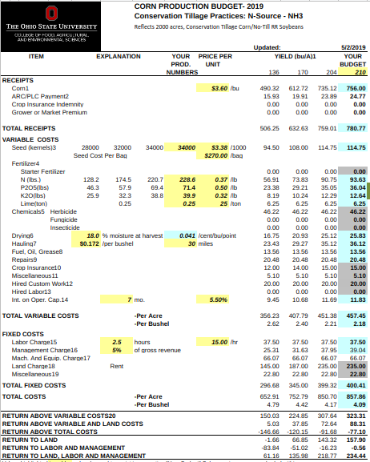
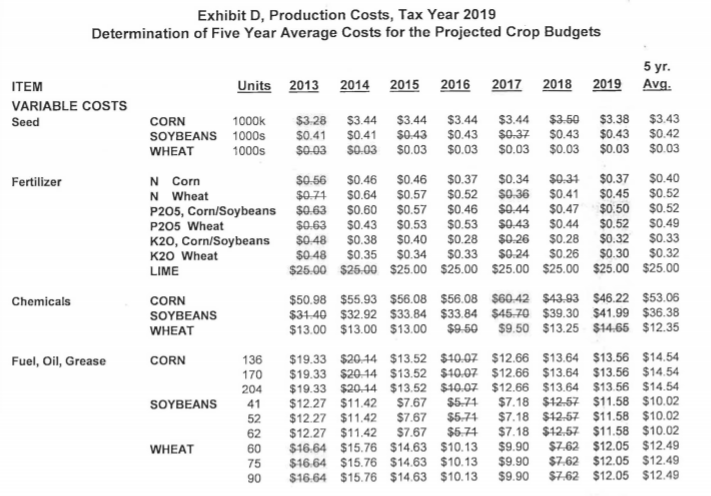
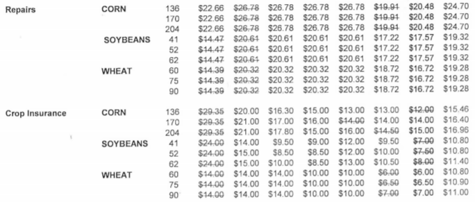
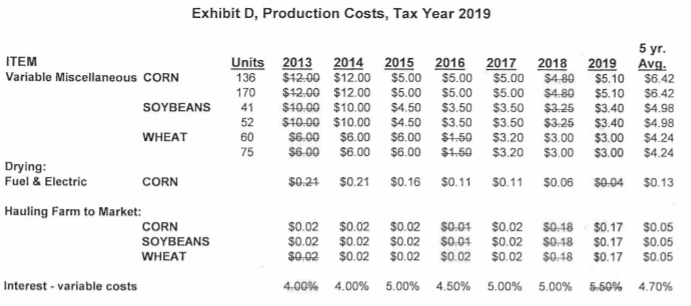
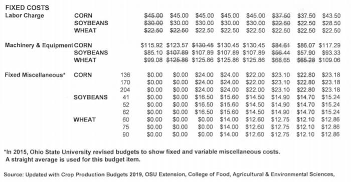
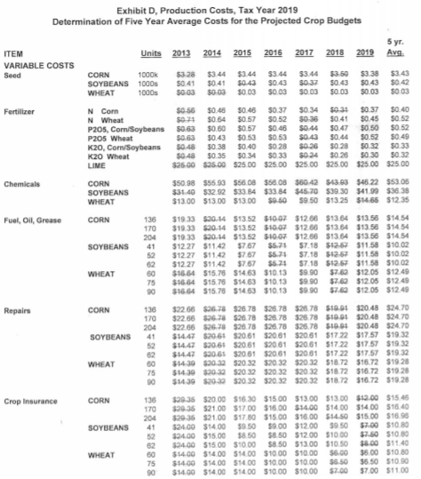
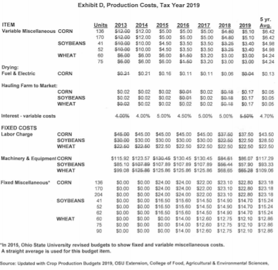
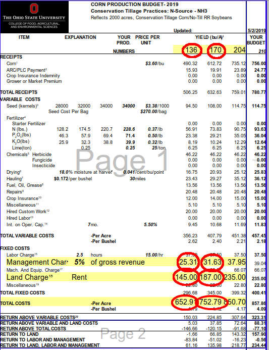
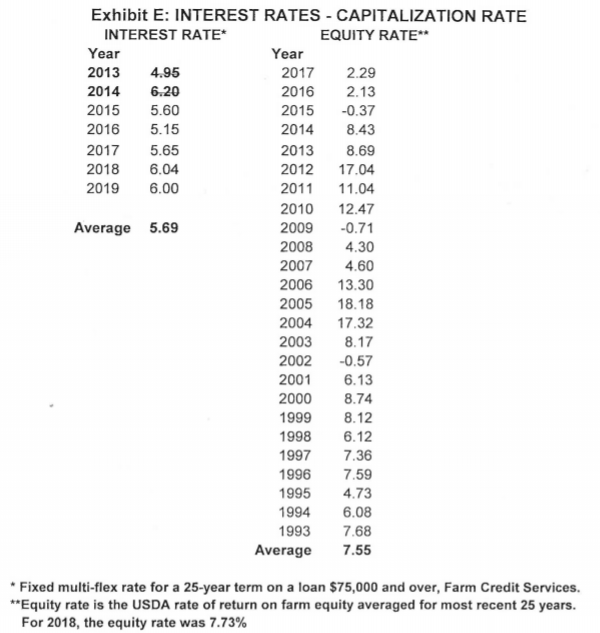
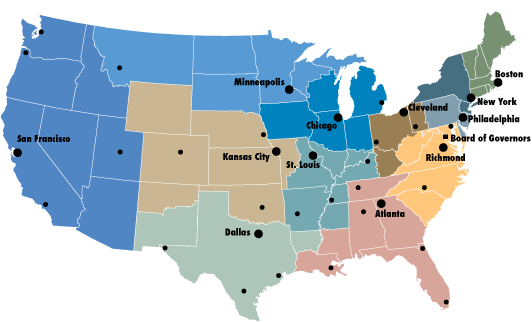

```{r setup, include=FALSE}
library(knitr)
library(kableExtra)
library(lubridate)
library(scales)
library(tidyverse)
opts_chunk$set(echo = TRUE, message = FALSE, echo = FALSE, message = FALSE, warning = FALSE)

cauv_indx <- read_csv("../0-data/offline/cauv_index_avg.csv") %>% 
  mutate_at(vars(-year), dollar) %>% 
  select(-num_soils)

# Add in the data
nonland_alt   <- read_rds("../2-calc/nonland/ohio_alternate_nonland.rds")
rot_alt       <- read_rds("../2-calc/rot/ohio_alternate_rotate.rds")
yield_alt     <- read_rds("../2-calc/yields/ohio_alternate_crops.rds")
cap_rates_raw <- read_csv("../0-data/cap_rate/capitalization_rate_alt.csv")
cap_rates_alt <- read_rds("../2-calc/cap/ohio_alternate_caprate.rds")
```

# Recommendations for CAUV Calculation

## Recommendations

<!-- Recommendations for the tax advisory board which would help with consistency in calculation procedures and update data with more reliable sources. -->

1. Non-Land Costs as an Olympic average of Total Costs less Rent and Management from OSU crop budgets
2. Calculate Rotations and Yields with a 7-year Olympic average to maintain consistency with other component calculations
3. Replace Farm Credit Service as the source for interest rates with a regional survey of agricultural interest rates from a Federal Reserve Bank
4. Align all data sources to cover the same years
    <!-- - Chicago, Kansas City, Minneapolis, San Francisco, Dallas, Richmond, and St. Louis all maintain agricultural credit surveys -->

See [http://robertdinterman.com/CAUV/](http://robertdinterman.com/CAUV/) for online version

## Historical CAUV Values

```{r cauv-reference}
cauv_indx %>% 
  filter(year > 2004) %>% 
  kable(booktabs = T) %>% 
  kable_styling(latex_options = "scale_down")
```


# Non-Land Costs Currently

## Current Methodology

- [Explanation of 2019 CAUV Calculations](https://www.tax.ohio.gov/Portals/0/personal_property/Explanation2019.pdf):

> Data on crop production costs are used to estimate average non-land production costs. The data are taken from the Ohio Crop Production Budgets prepared by The Ohio State University College of Food, Agricultural and Environmental Sciences for 2013-2019, inclusive. Again, data are collected for the seven-year period and the highest and lowest costs **for each category** are eliminated from the array. Five-year average costs per unit of specific non-land production cost items are computed from the remaining data as shown in Exhibit D (pages 9-10).


## Current Methodology

- Each OSU crop budget provides a "low", "medium", and "high" scenario for cost items and ODT uses a combination of "low" and "medium" to calculate Non-Land Costs for each soil type
- Two important values calculated for each Tax Year
    - *Base Cost*: based on the "low" productivity yields for each crop for the past 7 years
    - *Additional Costs*: based on a linear interpolation between the "low" and "medium" productivity values from the past 7 years for each component

## Current Methodology

- Every soil type ($s$) has an underlying Yield in their CAUV calculation for a particular Tax Year ($t$)

$$ {Nonland}_{s,t} = {Base}_{t} + \left( {Yield}_{s,t} - {low}_{t} \right) \times {Add}_{t}  $$

- A Yield value below the "low" productivity yield would have Additional Costs (multiplied by the difference) subtracted from Base Costs for its Non-Land Costs
- A Yield value above the "low" productivity would have Additional Costs (multiplied by the difference) added to Base Costs for its Non-Land Costs
- A Yield value equal to the "low" productivity in a budget would only have Base Costs for its Non-Land Costs


## Current Implementation

- OSU releases crop budget for every year
    - Preliminary release usually in October before the year
        - Released in October 2019 for 2020 crop year
    - Finalized values typically in May for the year in question
        - Expected to be finalized in May 2020 for 2020 crop year
- ODT records itemized costs for each crop then uses the previous 7 years of data on crop budgets to construct Non-Land Costs
    - The 2020 Tax Year will use OSU crop budgets from 2014-2020
- There were 137 different items in the corn, soybeans, and wheat crop budgets from OSU used in most recent 2019 CAUV calculation

## OSU Crop Budget for Corn in 2019



## Current Implementation

- Only major categories in OSU crop budgets not collected for calculation are Land Charge and Management Charge
    - Land Charge is rent which a landowner would not explicitly pay
    - Management Charge is not collected as this entails the oversight of owning a property
- ODT harmonizes each OSU crop budget to then calculate the Olympic average of each item:


<!-- ## ODT Method as of 2019 Tax Year -->

<!--  -->

<!-- ## ODT Method as of 2019 Tax Year (cont.) -->

<!--  -->

<!-- ## ODT Method as of 2019 Tax Year (cont.) -->

<!--  -->


<!-- ## ODT Method as of 2019 Tax Year (cont.) -->

<!--  -->

## ODT Method as of 2019 Tax Year



## ODT Method as of 2019 Tax Year (cont.)



## Current Implementation

- Potential issues:
    - Need to manually record each of the items for Non-Land Costs (process cannot be automated)
    - Terminology and classification of types of costs in crop budgets have changed over time
        - "Fixed Miscellaneous" and "Variable Miscellaneous" categories created in 2015
        - "Hired Custom Work" category created in 2018 which is partially a subset of "Mach. And Equip. Charge" category
    - Variance increases when more items are averaged

# Non-Land Costs Proposed Change

## Proposed Change

1. Non-Land Costs as an Olympic average of Total Costs less Land Charge and Management Charge from OSU Budgets as opposed to each individual component having an Olympic average and then summed up
- Reasoning:
    - Simpler method.
    - Safeguards against changes in definitions of variables for the OSU Budgets
    - More stable values for Non-Land Costs

## Relevant Aspects of Crop Budget



## Hypothetical Previous Values for Corn

```{r nonland-corn}
nonland_alt %>% 
  filter(year > 2011, !is.na(corn_cost_odt)) %>% 
  mutate(base = dollar(corn_cost_odt),
         base_alt = dollar(corn_cost_alt),
         base_diff = percent((corn_cost_alt - corn_cost_odt) / corn_cost_odt),
         
         add = dollar(corn_cost_add_odt),
         add_alt = dollar(corn_cost_add_alt),
         add_diff = percent((corn_cost_add_alt - corn_cost_add_odt) / corn_cost_add_odt)) %>% 
  select(Year = year, "ODT Base" = base, "Alt Base" = base_alt, "Diff Base" = base_diff,
         "ODT Add" = add, "Alt Add" = add_alt, "Diff Add" = add_diff) %>% 
  kable(booktabs = T) %>% 
  kable_styling(latex_options = "scale_down")
  
```

<!-- | Year | Base Cost | Alt Base Cost | Difference Base | Additional Cost | Alt Additional Cost | Difference Additional | -->
<!-- |------|------------|----------------|------------|-----------|---------------|-----------| -->
<!-- | 2012 | \$350.71   | \$366.08       | -\$15.37   | \$0.90    | \$1.04        | -\$0.14   | -->
<!-- | 2013 | \$391.90   | \$405.25       | -\$13.35   | \$1.04    | \$1.11        | -\$0.07   | -->
<!-- | 2014 | \$437.85   | \$452.42       | -\$14.57   | \$1.18    | \$1.26        | -\$0.08   | -->
<!-- | 2015 | \$516.99   | \$509.97       | \$7.02     | \$1.36    | \$1.42        | -\$0.06   | -->
<!-- | 2016 | \$524.47   | \$523.07       | \$1.40     | \$1.38    | \$1.41        | -\$0.03   | -->
<!-- | 2017 | \$538.78   | \$534.21       | \$4.57     | \$1.45    | \$1.44        | \$0.01    | -->
<!-- | 2018 | \$529.28   | \$534.21       | -\$4.93    | \$1.44    | \$1.44        | \$0.00    | -->
<!-- | 2019 | \$517.63   | \$528.08       | -\$10.45   | \$1.43    | \$1.43        | \$0.00    | -->


## Hypothetical Previous Values for Soybeans


```{r nonland-soy}
nonland_alt %>% 
  filter(year > 2011, !is.na(soy_cost_odt)) %>% 
  mutate(base = dollar(soy_cost_odt),
         base_alt = dollar(soy_cost_alt),
         base_diff = percent((soy_cost_alt - soy_cost_odt) / soy_cost_odt),
         
         add = dollar(soy_cost_add_odt),
         add_alt = dollar(soy_cost_add_alt),
         add_diff = percent((soy_cost_add_alt - soy_cost_add_odt) / soy_cost_add_odt)) %>% 
  select(Year = year, "ODT Base" = base, "Alt Base" = base_alt, "Diff Base" = base_diff,
         "ODT Add" = add, "Alt Add" = add_alt, "Diff Add" = add_diff) %>% 
  kable(booktabs = T) %>% 
  kable_styling(latex_options = "scale_down")
  
```

<!-- | Year | Base Cost | Alt Base Cost | Difference Base | Additional Cost | Alt Additional Cost | Difference Additional | -->
<!-- |------|------------|----------------|------------|-----------|---------------|-----------| -->
<!-- | 2012 | \$227.51   | \$231.09       | -\$3.58    | \$0.93    | \$1.09        | -\$0.16   | -->
<!-- | 2013 | \$248.69   | \$252.13       | -\$3.44    | \$1.12    | \$1.26        | -\$0.14   | -->
<!-- | 2014 | \$275.21   | \$279.22       | -\$4.01    | \$1.27    | \$1.47        | -\$0.20   | -->
<!-- | 2015 | \$325.42   | \$316.27       | \$9.15     | \$1.24    | \$1.40        | -\$0.16   | -->
<!-- | 2016 | \$336.33   | \$327.69       | \$8.64     | \$1.07    | \$1.18        | -\$0.11   | -->
<!-- | 2017 | \$347.10   | \$339.15       | \$7.95     | \$1.05    | \$1.06        | -\$0.01   | -->
<!-- | 2018 | \$346.26   | \$339.15       | \$7.11     | \$0.94    | \$1.10        | -\$0.16   | -->
<!-- | 2019 | \$338.54   | \$334.32       | \$4.22     | \$0.90    | \$0.95        | -\$0.05   | -->


## Hypothetical Previous Values for Wheat

```{r nonland-wheat}
nonland_alt %>% 
  filter(year > 2011, !is.na(wheat_cost_odt)) %>% 
  mutate(base = dollar(wheat_cost_odt),
         base_alt = dollar(wheat_cost_alt),
         base_diff = percent((wheat_cost_alt - wheat_cost_odt) / wheat_cost_odt),
         
         add = dollar(wheat_cost_add_odt),
         add_alt = dollar(wheat_cost_add_alt),
         add_diff = percent((wheat_cost_add_alt - wheat_cost_add_odt) / wheat_cost_add_odt)) %>% 
  select(Year = year, "ODT Base" = base, "Alt Base" = base_alt, "Diff Base" = base_diff,
         "ODT Add" = add, "Alt Add" = add_alt, "Diff Add" = add_diff) %>% 
  kable(booktabs = T) %>% 
  kable_styling(latex_options = "scale_down")
  
```

<!-- | Year | Base Cost | Alt Base Cost | Difference Base | Additional Cost | Alt Additional Cost | Difference Additional | -->
<!-- |------|------------|----------------|------------|-----------|---------------|-----------| -->
<!-- | 2012 | \$211.52   | \$215.26       | -\$3.74    | \$1.41    | \$1.05        | \$0.36    | -->
<!-- | 2013 | \$230.62   | \$235.79       | -\$5.17    | \$1.61    | \$1.31        | \$0.30    | -->
<!-- | 2014 | \$255.48   | \$265.47       | -\$9.99    | \$1.80    | \$1.46        | \$0.34    | -->
<!-- | 2015 | \$296.98   | \$300.96       | -\$3.98    | \$1.77    | \$1.48        | \$0.29    | -->
<!-- | 2016 | \$323.52   | \$313.03       | \$10.49    | \$1.64    | \$1.30        | \$0.34    | -->
<!-- | 2017 | \$336.21   | \$327.10       | \$9.11     | \$1.62    | \$1.56        | \$0.06    | -->
<!-- | 2018 | \$330.53   | \$327.10       | \$3.43     | \$1.49    | \$1.56        | -\$0.07   | -->
<!-- | 2019 | \$319.08   | \$314.42       | \$4.66     | \$1.41    | \$1.42        | -\$0.01   | -->


## Hypothetical Previous Values

- Ultimate effect on CAUV values is near zero
    - Corn about the same
    - Soybeans higher on average
    - Wheat lower on average
- Easier to calculate, interpret, and understand
- Values are more stable

## Hypothetical Previous CAUV Values

```{r rec-nonland}
read_rds("../3-proj/recommendations/ohio_nonland_alt.rds") %>% 
  filter(year > 2011, year < 2020) %>% 
  left_join(select(cauv_indx, year, official_avg = avg_cauv)) %>% 
  mutate(pct = percent((parse_number(avg_cauv) - parse_number(official_avg)) / parse_number(official_avg), accuracy = 0.1)) %>% 
  select(Year = year, "Avg CAUV" = official_avg, "Alt Avg CAUV" = avg_cauv, "Pct Chg" = pct, everything()) %>% 
  kable(booktabs = T) %>% 
  kable_styling(latex_options = "scale_down")
```

# Rotations and Yields Currently

## Rotations Method Currently

- [Explanation of 2019 CAUV Calculations](https://www.tax.ohio.gov/Portals/0/personal_property/Explanation2019.pdf):

> The cropping pattern for each map unit is assigned a rotation based on the most recent five year average of crop acres harvested in Ohio: 38\% corn, 56\% beans, and 6\% wheat. This rotation is based on data from 2014-2018 and closely reflects current agricultural production in Ohio. The acres harvested in each year are shown in Exhibit B (page 7).

## Yields Method Currently

- [Explanation of 2019 CAUV Calculations](https://www.tax.ohio.gov/Portals/0/personal_property/Explanation2019.pdf):

> For each of the soil mapping units, data regarding typical yields of each of the major field crops (corn, soybeans and wheat) were last published in 1984. In order to reflect more accurate yields, those yields of record have been updated annually since 2006. The yields are updated by a factor based on ten years of statewide yield information published by USDA. For 2019, yield data from calendar years 2009-2018 were averaged and divided by the 1984 yield for each crop (Exhibit A, page 6). This factor is applied to the 1984 crop yield of record for each soil. The table below shows the average yields used to develop the factor for each of the crops.

## Rotations and Yields Methods Currently

- Only two components which do not use 7 years worth of data or an Olympic average
    - Not counting equity yield rate because per recent legislation: Equity yield rate is 25-year average of the "total rate of return on farm equity" published by USDA
- Rotations are based on harvested acreage data from USDA of corn, soybeans, and wheat from previous 5 years and averaged
- Yields are based on harvested yield data from USDA of corn, soybeans, and wheat from previous 10 years and averaged


# Rotations and Yields Proposed Change

## Proposed Change

2. Calculate Rotations and Yields with a 7-year Olympic average
- Reasoning:
    - Consistency to length of other components averaging
    - Olympic average helps reduce variance

## Proposed Change Effect on Rotations

```{r rotation-proposed}
rot_alt %>% 
  filter(year > 2009, year < 2020) %>% 
  mutate(corn_rotate_alt = scales::percent(corn_rotate_alt, accuracy = 0.1),
         corn_rotate_odt = scales::percent(corn_rotate_odt, accuracy = 0.1),
         soy_rotate_alt = scales::percent(soy_rotate_alt, accuracy = 0.1),
         soy_rotate_odt = scales::percent(soy_rotate_odt, accuracy = 0.1),
         wheat_rotate_alt = scales::percent(wheat_rotate_alt, accuracy = 0.1),
         wheat_rotate_odt = scales::percent(wheat_rotate_odt, accuracy = 0.1)) %>% 
  select("Year" = year,
         "ODT Corn" = corn_rotate_odt,
         "Alt Corn" = corn_rotate_alt,
         "ODT Soybeans" = soy_rotate_odt,
         "Alt Soybeans" = soy_rotate_alt,
         "ODT Wheat" = wheat_rotate_odt,
         "Alt Wheat" = wheat_rotate_alt) %>% 
  kable(booktabs = T) %>% 
  kable_styling(latex_options = "scale_down")
```

<!-- | Year|ODT Corn |Alt Corn |ODT Soybeans |Alt Soybeans |ODT Wheat |Alt Wheat | -->
<!-- |----:|:--------|:--------|:------------|:------------|:---------|:---------| -->
<!-- | 2010|39.0\%   |36.7\%   |51.0\%       |52.7\%       |10.0\%    |10.6\%    | -->
<!-- | 2011|38.6\%   |36.9\%   |50.9\%       |52.2\%       |10.5\%    |10.9\%    | -->
<!-- | 2012|38.6\%   |37.2\%   |51.1\%       |52.6\%       |10.3\%    |10.2\%    | -->
<!-- | 2013|38.7\%   |37.2\%   |51.2\%       |52.7\%       |10.1\%    |10.1\%    | -->
<!-- | 2014|38.6\%   |37.8\%   |52.0\%       |52.5\%       |9.4\%     |9.7\%     | -->
<!-- | 2015|40.0\%   |38.8\%   |52.6\%       |52.7\%       |7.4\%     |8.5\%     | -->
<!-- | 2016|40.2\%   |39.2\%   |53.0\%       |53.3\%       |6.8\%     |7.5\%     | -->
<!-- | 2017|40.0\%   |39.4\%   |54.0\%       |53.8\%       |6.0\%     |6.8\%     | -->
<!-- | 2018|39.0\%   |39.3\%   |55.0\%       |54.5\%       |6.0\%     |6.2\%     | -->
<!-- | 2019|38.0\%   |39.2\%   |56.0\%       |55.1\%       |6.0\%     |5.8\%     | -->

## Proposed Change Effect on Rotations

- Slower adjustment for year-to-year fluctuations in crop rotations
    - In early 2010s, skew slightly more towards Soybeans than Corn
    - In the later 2010s, skew reverses towards Corn
- Smaller year-to-year variation with proposed method
- Note: hay was removed from formula in 2010


## Proposed Change Effect on Yields

```{r yield-proposed}
yield_alt %>% 
  filter(year > 2009, !is.na(corn_yield_odt)) %>% 
  mutate_if(is.numeric, ~round(., digits = 1)) %>% 
  mutate(corn_diff = percent((corn_yield_alt - corn_yield_odt) / corn_yield_odt, accuracy = 0.1),
         soy_diff = percent((soy_yield_alt - soy_yield_odt) / soy_yield_odt, accuracy = 0.1),
         wheat_diff = percent((wheat_yield_alt - wheat_yield_odt) / wheat_yield_odt, accuracy = 0.1)) %>% 
  select("Year" = year,
         "ODT Corn" = corn_yield_odt,
         "Alt Corn" = corn_yield_alt,
         "Corn Diff" = corn_diff,
         "ODT Soybeans" = soy_yield_odt,
         "Alt Soybeans" = soy_yield_alt,
         "Soybeans Diff" = soy_diff,
         "ODT Wheat" = wheat_yield_odt,
         "Alt Wheat" = wheat_yield_alt,
         "Wheat Diff" = wheat_diff) %>% 
  kable(booktabs = T) %>% 
  kable_styling(latex_options = "scale_down")
```
<!-- | Year| ODT Corn| Alt Corn| ODT Soybeans| Alt Soybeans| ODT Wheat| Alt Wheat| -->
<!-- |----:|--------:|--------:|------------:|------------:|---------:|---------:| -->
<!-- | 2010|    140.1|    147.6|         41.2|         42.7|      67.1|      65.4| -->
<!-- | 2011|    144.9|    153.2|         42.5|         44.9|      67.3|      67.2| -->
<!-- | 2012|    146.5|    154.0|         43.1|         46.8|      66.2|      65.8| -->
<!-- | 2013|    148.5|    153.0|         43.7|         47.0|      65.3|      65.6| -->
<!-- | 2014|    151.9|    150.6|         45.0|         47.0|      66.0|      65.0| -->
<!-- | 2015|    155.2|    157.8|         46.7|         47.9|      67.1|      67.4| -->
<!-- | 2016|    156.2|    162.2|         47.2|         48.9|      66.7|      67.4| -->
<!-- | 2017|    156.2|    159.8|         47.9|         49.6|      67.9|      68.0| -->
<!-- | 2018|    158.9|    163.0|         48.2|         49.9|      69.2|      70.6| -->
<!-- | 2019|    164.1|    167.8|         50.4|         51.2|      69.9|      72.2| -->

## Proposed Change Effect on Yields

- Because yields generally trend upward, reducing the number of years averaged will inherently increase the yields because smaller values are more likely to drop out
    - Up to a 5\% increase in Corn yields or unaffected
    - Up to a 9\% increase in Soybeans yields but more likely 3\% increase
    - Up to a 3\% increase in Wheat yields but most likely unaffected
- CAUV effects are intertwined with the additional costs of the Non-Land Costs aspect

## Hypothetical CAUV Values for Rotations


```{r rec-rot}
read_rds("../3-proj/recommendations/ohio_rot_alt.rds") %>% 
  filter(year > 2009, year < 2020) %>% 
  left_join(select(cauv_indx, year, official_avg = avg_cauv)) %>% 
  mutate(pct = percent((parse_number(avg_cauv) - parse_number(official_avg)) / parse_number(official_avg), accuracy = 0.1)) %>% 
  select(Year = year, "Avg CAUV" = official_avg, "Alt Avg CAUV" = avg_cauv, "Pct Chg" = pct, everything()) %>% 
  kable(booktabs = T) %>% 
  kable_styling(latex_options = "scale_down")
```

## Hypothetical CAUV Values for Yields


```{r rec-yields}
read_rds("../3-proj/recommendations/ohio_yield_alt.rds") %>% 
  filter(year > 2009, year < 2020) %>% 
  left_join(select(cauv_indx, year, official_avg = avg_cauv)) %>% 
  mutate(pct = percent((parse_number(avg_cauv) - parse_number(official_avg)) / parse_number(official_avg), accuracy = 0.1)) %>% 
  select(Year = year, "Avg CAUV" = official_avg, "Alt Avg CAUV" = avg_cauv, "Pct Chg" = pct, everything()) %>% 
  kable(booktabs = T) %>% 
  kable_styling(latex_options = "scale_down")
```

## Hypothetical CAUV Values for Rotations and Yields


```{r rec-rot-yield}
read_rds("../3-proj/recommendations/ohio_rot_yield_alt.rds") %>% 
  filter(year > 2009, year < 2020) %>% 
  left_join(select(cauv_indx, year, official_avg = avg_cauv)) %>% 
  mutate(pct = percent((parse_number(avg_cauv) - parse_number(official_avg)) / parse_number(official_avg), accuracy = 0.1)) %>% 
  select(Year = year, "Avg CAUV" = official_avg, "Alt Avg CAUV" = avg_cauv, "Pct Chg" = pct, everything()) %>% 
  kable(booktabs = T) %>% 
  kable_styling(latex_options = "scale_down")
```


# Capitalization Rate Currently

## Capitalization Rate Currently

- [Explanation of 2019 CAUV Calculations](https://www.tax.ohio.gov/Portals/0/personal_property/Explanation2019.pdf):

> **Five-year averaging is used to derive the Farm Credit Service interest rate of 5.69\% assuming an 80\% loan for a 25-year term, payable annually** (Exhibit E, page 14). The interest rate of 7.55\% for the 20 percent equity portion is based on the 25-year average of the "total rate of return on farm equity" published by USDA (1993-2017, inclusive). (RC. 5715.01) 

## Interest Rates Current Calculation



## Interest Rates Current Implementation

- Olympic average of most recent 7 years of data
- ODT collects their interest rates through systematically calling a Farm Credit Service location for a hypothetical 25-year term loan of \$75,000 at their fixed multi-flex rate
    - Call occurs same day each month
    - Averaged over the months collected
- Potential Issues:
    - Not official product of a research based agency
    - Farm Credit Service does not publish or maintain historical data on interest rates
    - Is this method verifiable?


# Capitalization Rate Proposed

## Capitalization Rate Proposed

3. Replace Farm Credit Service as the source for interest rates with a regional survey of agricultural interest rates from a Federal Reserve Bank (values would be from first quarter of the year in question)
- Reasoning:
    - Kansas City Fed provides [Agricultural Finance Book](https://www.kansascityfed.org/research/indicatorsdata/agfinancedatabook)
    - Sheet "afdr_c4" provides quarterly values of long-term real estate interest rates for districts:
        - Chicago, Kansas City, Minneapolis, San Francisco, Dallas, Richmond, and St. Louis
    - Provides a verifiable value for interest rates which are [publicly available](https://www.kansascityfed.org/research/indicatorsdata/agcreditsurvey)

## Federal Reserve Districts




## Interest Rates Proposed (Raw Values)

```{r interest-rates}
cap_rates_raw %>% 
  filter(month(date) == 3, year > 2008) %>% 
  select(Year = year, "FCS (ODT)" = interest_rate_25_odt,
         Chicago = chicago_fed_re, "Kansas City" = kansascity_fed_re,
         Minneapolis = minneapolis_fed_re, "San Francisco" = sanfrancisco_fed_re,
         Dallas = dallas_fed_re, Richmond = richmond_fed_re,
         "St. Louis" = stlouis_fed_re) %>% 
  mutate_at(vars(-Year), ~scales::percent(., accuracy = 0.1)) %>% 
  kable(booktabs = T) %>% 
  kable_styling(latex_options = "scale_down")
```

<!-- \small -->
<!-- | Raw Values | FCS (ODT) | Chicago | Kansas City | Minneapolis | San Francisco | Dallas | Richmond | St. Louis | -->
<!-- |------------|------------|----------|--------------|--------------|----------------|---------|-----------|-----------| -->
<!-- | 2009       | 7.10\%     | 6.10\%   | 6.59\%       | 6.48\%       | 6.90\%         | 6.78\%  | 7.11\%    | .         | -->
<!-- | 2010       | 7.40\%     | 6.00\%   | 6.61\%       | 6.44\%       | 7.08\%         | 6.80\%  | 6.92\%    | .         | -->
<!-- | 2011       | 6.70\%     | 5.80\%   | 6.30\%       | 6.10\%       | 6.50\%         | 6.50\%  | 6.48\%    | .         | -->
<!-- | 2012       | 5.15\%     | 5.10\%   | 5.76\%       | 5.53\%       | 6.03\%         | 6.20\%  | 5.92\%    | .         | -->
<!-- | 2013       | 4.95\%     | 4.60\%   | 5.36\%       | 5.03\%       | 4.67\%         | 6.12\%  | 5.43\%    | 5.12\%     | -->
<!-- | 2014       | 6.20\%     | 4.70\%   | 5.41\%       | 5.08\%       | 5.25\%         | 5.89\%  | 5.55\%    | 5.20\%     | -->
<!-- | 2015       | 5.60\%     | 4.60\%   | 5.30\%       | 5.00\%       | 4.90\%         | 5.70\%  | 5.60\%    | 5.00\%     | -->
<!-- | 2016       | 5.15\%     | 4.60\%   | 5.36\%       | 5.08\%       | 5.35\%         | 5.81\%  | 5.43\%    | 5.18\%     | -->
<!-- | 2017       | 5.65\%     | 4.80\%   | 5.51\%       | 5.30\%       | 5.90\%         | 6.00\%  | 5.30\%    | 5.30\%     | -->
<!-- | 2018       | 6.04\%     | 5.10\%   | 5.80\%       | 5.60\%       | 5.80\%         | 6.10\%  | 5.90\%    | 5.40\%     | -->
<!-- | 2019       | 6.00\%     | 5.53\%   | 6.17\%       | 6.00\%       | 6.36\%         | 6.58\%  | 6.33\%    | 6.16\%     | -->

## Interest Rates Proposed (Raw Values)

```{r interest-rates-line}
cap_rates_raw %>% 
  # filter(month(date) == 3) %>% 
  select(date, # "FCS (ODT)" = interest_rate_25_odt,
         Chicago = chicago_fed_re, "Kansas City" = kansascity_fed_re,
         Minneapolis = minneapolis_fed_re, "San Francisco" = sanfrancisco_fed_re,
         Dallas = dallas_fed_re, Richmond = richmond_fed_re,
         "St. Louis" = stlouis_fed_re) %>% 
  gather(var, val, -date) %>% 
  ggplot(aes(date, val, color = var, linetype = var)) +
    geom_line(data = cap_rates_raw %>% filter(month(date) == 3) %>% select(date, interest_rate_25_odt),
            aes(x = date, y = interest_rate_25_odt,
                linetype = NULL, color = NULL), size = 2) +
  geom_line() +
  scale_y_continuous(labels = scales::percent) +
  theme_minimal() +
  theme(legend.position = "bottom") +
  labs(x = "", y = "", color = "Federal Reserve \nDistrict",
       linetype = "Federal Reserve \nDistrict",
       subtitle = "ODT value bolded in black") +
  guides(linetype = guide_legend(override.aes = list(size = 0.5)),
         color = guide_legend(override.aes = list(size = 0.5)))
```

## Interest Rates Proposed (Olympic Average)

```{r interest-rates-olympic}
cap_rates_alt %>% 
  filter(year > 2008, !is.na(interest_rate_odt)) %>% 
  select(Year = year, "FCS (ODT)" = interest_rate_odt,
         Chicago = chicago_fed_re, "Kansas City" = kansas_fed_re,
         Dallas = dallas_fed_re) %>% 
  mutate_at(vars(-Year), ~scales::percent(., accuracy = 0.01)) %>% 
  kable(booktabs = T) %>% 
  kable_styling(latex_options = "scale_down")
  
```

<!-- | Olympic Avg. | FCS (ODT) | Chicago | Kansas City | Minneapolis | San Francisco | Dallas | Richmond | St. Louis | -->
<!-- |--------------|------------|----------|--------------|--------------|----------------|---------|-----------|-----------| -->
<!-- | 2015         | 6.15\%     | 5.24\%   | 5.88\%       | 5.64\%       | 5.92\%         | 6.30\%  | 6.09\%    | .         | -->
<!-- | 2016         | 5.76\%     | 4.96\%   | 5.64\%       | 5.36\%       | 5.61\%         | 6.10\%  | 5.80\%    | .         | -->
<!-- | 2017         | 5.55\%     | 4.76\%   | 5.48\%       | 5.20\%       | 5.49\%         | 6.00\%  | 5.59\%    | .         | -->
<!-- | 2018         | 5.52\%     | 4.76\%   | 5.48\%       | 5.20\%       | 5.44\%         | 5.98\%  | 5.58\%    | .         | -->
<!-- | 2019         | 5.69\%     | 4.76\%   | 5.49\%       | 5.22\%       | 5.44\%         | 5.98\%  | 5.58\%    | 5.24\%     | -->

## Capitalization Rate Proposed

- Federal Reserve Agricultural Credit Surveys trend in the same direction but have different levels of interest rates
    - Chicago consistently the lowest rates
    - Dallas consistently the highest rates
    - Kansas City is a moderate value and the most agricultural focused Federal Reserve Bank
- Interest rates are only one part of the capitalization rate formula
    - Equity rate, assumed term of loan, and sinking funds factor also matter
    - The current 80-20 loan to equity ratio further limits the impact that interest rates on farmland have on capitalization rate

## Capitalization Rate Proposed

```{r cap-rate-proposed}
cap_rates_alt %>% 
  filter(year > 2008, !is.na(cap_rate_odt)) %>% 
  select("Year" = year, "ODT Value" = cap_rate_odt,
         "Dallas" = cap_rate_dallas,
         "Kansas City" = cap_rate_kansas,
         "Chicago" = cap_rate_chicago) %>% 
  mutate_at(vars(-Year), ~scales::percent(., accuracy = 0.1)) %>% 
  kable(booktabs = T) %>% 
  kable_styling(latex_options = "scale_down")
```
<!-- | Year|ODT Value |Dallas |Kansas City |Chicago | -->
<!-- |----:|:---------|:------|:-----------|:-------| -->
<!-- | 2010|7.8\%     |8.0\%  |7.9\%       |7.5\%   | -->
<!-- | 2011|7.6\%     |7.8\%  |7.7\%       |7.3\%   | -->
<!-- | 2012|7.5\%     |7.7\%  |7.5\%       |7.2\%   | -->
<!-- | 2013|6.7\%     |7.0\%  |6.8\%       |6.5\%   | -->
<!-- | 2014|6.2\%     |6.5\%  |6.3\%       |5.9\%   | -->
<!-- | 2015|6.6\%     |6.8\%  |6.4\%       |5.9\%   | -->
<!-- | 2016|6.3\%     |6.6\%  |6.2\%       |5.7\%   | -->
<!-- | 2017|8.0\%     |8.2\%  |8.0\%       |7.5\%   | -->
<!-- | 2018|8.0\%     |8.2\%  |8.0\%       |7.5\%   | -->
<!-- | 2019|8.0\%     |8.2\%  |7.9\%       |7.5\%   | -->
<!-- | 2020|NA        |8.1\%  |7.8\%       |7.4\%   | -->
<!-- | 2021|NA        |8.1\%  |7.8\%       |7.4\%   | -->

## Hypothetical CAUV Values from Kansas City Capitalization Rate

```{r rec-kansas}
read_rds("../3-proj/recommendations/ohio_cap_kansas.rds") %>% 
  filter(year > 2009, year < 2020) %>% 
  left_join(select(cauv_indx, year, official_avg = avg_cauv)) %>% 
  mutate(pct = percent((parse_number(avg_cauv) - parse_number(official_avg)) / parse_number(official_avg), accuracy = 0.1)) %>% 
  select(Year = year, "Avg CAUV" = official_avg, "Alt Avg CAUV" = avg_cauv, "Pct Chg" = pct, everything()) %>% 
  kable(booktabs = T) %>% 
  kable_styling(latex_options = "scale_down")
```


## Hypothetical CAUV Values from Chicago Capitalization Rate

```{r rec-chicago}
read_rds("../3-proj/recommendations/ohio_cap_chicago.rds") %>% 
  filter(year > 2009, year < 2020) %>% 
  left_join(select(cauv_indx, year, official_avg = avg_cauv)) %>% 
  mutate(pct = percent((parse_number(avg_cauv) - parse_number(official_avg)) / parse_number(official_avg), accuracy = 0.1)) %>% 
  select(Year = year, "Avg CAUV" = official_avg, "Alt Avg CAUV" = avg_cauv, "Pct Chg" = pct, everything()) %>% 
  kable(booktabs = T) %>% 
  kable_styling(latex_options = "scale_down")
```


## Hypothetical CAUV Values from Dallas Capitalization Rate


```{r rec-dallas}
read_rds("../3-proj/recommendations/ohio_cap_dallas.rds") %>% 
  filter(year > 2009, year < 2020) %>% 
  left_join(select(cauv_indx, year, official_avg = avg_cauv)) %>% 
  mutate(pct = percent((parse_number(avg_cauv) - parse_number(official_avg)) / parse_number(official_avg), accuracy = 0.1)) %>% 
  select(Year = year, "Avg CAUV" = official_avg, "Alt Avg CAUV" = avg_cauv, "Pct Chg" = pct, everything()) %>% 
  kable(booktabs = T) %>% 
  kable_styling(latex_options = "scale_down")
```
# Data Years Used

## All Data Years Currently Used

| Tax Year|Capitalization Rate |Yields    |Prices    |Non-Land Costs |Rotation  |
|--------:|:-------------------|:---------|:---------|:--------------|:---------|
|     2014|2008-2014           |2003-2012 |2006-2012 |2007-2013      |2008-2012 |
|     2015|2009-2015           |2005-2014 |2008-2014 |2009-2015      |2010-2014 |
|     2016|2010-2016           |2006-2015 |2009-2015 |2010-2016      |2011-2015 |
|     2017|2011-2017           |2007-2016 |2010-2016 |2011-2017      |2012-2016 |
|     2018|2012-2018           |2008-2017 |2011-2017 |2012-2018      |2013-2017 |
|     2019|2013-2019           |2009-2018 |2012-2018 |2013-2019      |2014-2018 |
| Future Years|current to 6 years ago |previous to 11 years ago |previous to 7 years ago |current to 6 years ago |previous to 5 years ago |
| Averaging|7 Olympic |10 Average, lagged |7 Olympic, lagged |7 Olympic |5 Average, lagged |

## Current Implementation

- Potential Issues:
    - Year to year variation in net farm income can be large
        - For US, 2013 was a high farm income year (\$137 billion) but 2014 had almost a 30\% drop (to \$100 billion)
    - Inconsistent data inputs
        - "Current" year does not include the same year's Yields, Prices, and Rotation (this is because that data will not be finalized)
        - No data on Capitalization Rate, Non-Land Costs, or Rotation from 7 years ago

# Data Year Proposed Change

## Proposed Change

4. Align all data sources to cover the same years
    - Implication would be that Capitalization Rate and Non-Land Costs are lagged one year
    - Rotations and Yields would also have a 7-year average
- Reasoning:
    - Consistency
    - Better approximates the average net farm income from the past 7 years
    - Easier interpretation for what the CAUV program estimates

<!--     - Most recent USDA price data are only estimates for a given marketing year -->
<!--         - Corn and Soybeans marketing year begins September 1st -->
<!--         - Wheat marketing year begins June 1st -->

## Hypothetical CAUV Values with Same Data Years

```{r rec-same-date}
read_rds("../3-proj/recommendations/ohio_same_dates.rds") %>% 
  filter(year > 2009, year < 2020) %>% 
  left_join(select(cauv_indx, year, official_avg = avg_cauv)) %>% 
  mutate(pct = percent((parse_number(avg_cauv) - parse_number(official_avg)) / parse_number(official_avg), accuracy = 0.1)) %>% 
  select(Year = year, "Avg CAUV" = official_avg, "Alt Avg CAUV" = avg_cauv, "Pct Chg" = pct, everything()) %>% 
  kable(booktabs = T) %>% 
  kable_styling(latex_options = "scale_down")
```

- Note: Tax Year 2015 and beyond use one year lagged data (2015 is 2008-2014) while the years before 2015 use two year lagged data (2014 is 2006-2012)
- Note: capitalization rate for each year was lagged to match up with the ODT definition which used the years in question

# Total Effect of All Proposed Changes

## Total Effect

- Each proposed change would at least slightly alter the average CAUV for a soil in Ohio
    - Some proposals increase CAUV values while others decrease CAUV values 
- Determining the impact of adopting multiple proposals is not as simple as averaging the hypothetical CAUV values provided here
    - "Average" CAUV is the average across all soil types but there is variation across the productivity of each soil type
    - Also soil types vary based on acreage within the state and would not represent the amount collected on CAUV
- Assumes that the Kansas City Federal Reserve capitalization rate is adopted
- Largest proposed change is due to shifting the years used, therefore results are presented with this implemented and then without

## Hypothetical CAUV Values (with all)

```{r rec-all-implemented}
read_rds("../3-proj/recommendations/ohio_all_implemented.rds") %>% 
  filter(year > 2011, year < 2021) %>% 
  left_join(select(cauv_indx, year, official_avg = avg_cauv)) %>% 
  mutate(pct = percent((parse_number(avg_cauv) - parse_number(official_avg)) / parse_number(official_avg), accuracy = 0.1)) %>% 
  select(Year = year, "Avg CAUV" = official_avg, "Alt Avg CAUV" = avg_cauv, "Pct Chg" = pct, everything()) %>% 
  kable(booktabs = T) %>% 
  kable_styling(latex_options = "scale_down")
```

## Hypothetical CAUV Values (without aligning data years)

```{r rec-all-withoutdates}
read_rds("../3-proj/recommendations/ohio_all_withoutdates.rds") %>% 
  filter(year > 2011, year < 2021) %>% 
  left_join(select(cauv_indx, year, official_avg = avg_cauv)) %>% 
  mutate(pct = percent((parse_number(avg_cauv) - parse_number(official_avg)) / parse_number(official_avg), accuracy = 0.1)) %>% 
  select(Year = year, "Avg CAUV" = official_avg, "Alt Avg CAUV" = avg_cauv, "Pct Chg" = pct, everything()) %>% 
  kable(booktabs = T) %>% 
  kable_styling(latex_options = "scale_down")
```

## Total Effect

- Anticipated values for 2020 Tax Year are provided (our current unadjusted projections are for \$593 in 2020 then \$634 in 2021)
    - With aligned data years, the Capitalization Rate and Non-Land Costs are already known and the other components assume the 2019 USDA data will be the same as 2018
    - Without aligned data years, the Capitalization Rate and Non-Land Costs would not be known and the same procedure of assuming the 2020 values will equal the 2019 values is used
- With aligned data, higher CAUV values than without aligned data for the years of 2012 to 2019
    - Trend reverses in 2020 as aligned data would be lower than without aligning the data years
    - Years prior to 2015 are difficult to interpret because we use the prevailing ODT definitions for the Capitalization Rate at the time aside from replacing interest with Kansas City Federal Reserve data

# Thank You


## Thank You

Questions? Comments? Concerns?

<!-- - Robert Dinterman dinterman.1@osu.edu -->
<!-- - Ani Katchova katchova.1@osu.edu -->