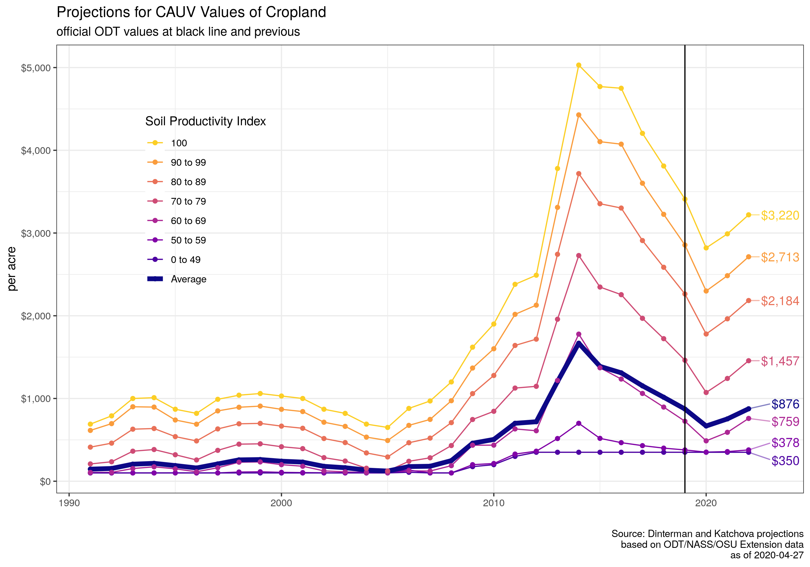

# CAUV

The purpose of this repository is to have open source documentation of the calculation for Ohio's Current Agricultural Use Value (CAUV) Program. Secondarily, this repository produces projections for future CAUV values for soil types in Ohio. Likely of most interest is the [current projections](3-proj/) for CAUV that you can find by clicking that link. A more dynamic version with descriptions is available at [Ohio CAUV Value projections for 2020, 2021, and 2020](4-presentations/4-projection-may-2020) -- with the [PDF version also available](4-presentations/4-projection-may-2020.pdf). Previous versions for the [Ohio CAUV Value Projections for 2019 and 2020](4-presentations/4-projections-2019-2020) and its [PDF version also available](4-presentations/4-projections-2019-2020.pdf).

The calculations and projections for each soil type in Ohio are based on the [2017 formulation](https://ofbf.org/2017/08/24/cauv-reform-passed/) which substantially changed the methodology for CAUV values from previous years. The Ohio Department of Taxation (ODT) provides an [overview of the caclulation for CAUV values](https://www.tax.ohio.gov/real_property/cauv.aspx) which are used within this repository.

Current projections:

[](3-proj/figures/cauv_expected_projections_currently.png)

Recommendations for altering the calculation procedure for CAUV calculations presented on 2020-01-08:

- [Presentation](4-presentations/4-recommendations) (and in [PDF format](4-presentations/4-recommendations.pdf))
- [Write-up](4-presentations/4-recommendations-writeup) (and in [PDF format](4-presentations/4-recommendations-writeup.pdf))


# Components:

An oversimplified description of how to calculate the CAUV value for a particular soil type is that it is the expected net returns from farming corn, soybeans, and wheat on an acre of land divided by capitalization rate to give a present value for owning a piece of land for commercial agricultural production. Please read the [CAUV formula description](formula) for a more in-depth understanding of the program. The following pages provide description of the data involved with each component:

1. [Rotation](rotation)
2. [Yields](yields)
3. [Prices](prices)
4. [Non-Land Costs](nonland)
5. [Capitalization Rate](caprate)

The [usdarnass package](https://cran.r-project.org/web/packages/usdarnass/) is used for updating official USDA data and is not on CRAN. To install, a user must run the following command in R:

``` r
devtools::install_github("rdinter/usdarnass")
```

Afterwards, the user must register a [NASS API Key](https://quickstats.nass.usda.gov/api) through USDA and install the key on their local machine with the `set_nass_key("YOUR_KEY_IN_QUOTATIONS")` command with the `nassR` library.

# Organization:

The structure of the repository is as follows:

- [0-data/](0-data/)
    - `0-data_source.R` - script to download data and create `.csv` and `.rds` files in an easy to read and uniform format. Some of these data are not online and cannot be downloaded. For those data that cannot be downloaded, they reside in this repository.
    - data_source/ - most of this will be ignored via `.gitignore`.
        - raw/
            - All downloaded files from the `0-data_source.R` script.
            - Some data cannot be downloaded and must be hosted elsewhere. They will also be in this folder for local use.
        - `various_names.csv`
        - `various_names.rds`
    - `.gitignore` - any large files will not be loaded to GitHub.
- [1-tidy/](1-tidy/)
    - `1-tidy-cauv.R` - script to gather and format data in a usable way by each component
    - `ohio_cauv_all` - as .csv and .rds but these are all of the components joined together which is a large amount of variables.
    - component/
        - Properly formatted and gathered data for further analysis on a particular component of the CAUV calculation (prices, yields, harvested acreage, capitalization rate, and non-land costs).
- [2-calc/](2-calc/)
    - component/ - projections for each component in the CAUV formula.
        - `2-calc_component.R` - each component.
- [3-proj/](3-proj/)
    - project/ - depends on different calculation scenarios one wants to utilize in calculating CAUV.
        - `3-project_proj.R` - projected calculation of CAUV based upon the project at play. These will include high and low based on the Olympic averaging component of the CAUV calculation. Other projections place restrictions on how one would anticipate trends in particular components.
- [4-presentations/](4-presentations/)
    - [Recommendations](4-presentations/4-recommendations)
    - [Farm Science Review](4-presentations/4-FSR-2018)
    - [Ohio CAUV Value Projections for 2019 and 2020](4-presentations/4-projections-2019-2020)


## Years Used in CAUV Calculation

All categories are Olympic averages with the exception of rotation and yields.

| Tax Year|Capitalization Rate |Yields    |Prices    |Non-Land Costs |Rotation  |
|--------:|:-------------------|:---------|:---------|:--------------|:---------|
|     2005|1999-2005           |1984      |1997-2003 |1998-2004      |ad hoc    |
|     2006|2000-2006           |1995-2004 |1998-2004 |1999-2005      |ad hoc    |
|     2007|2001-2007           |1996-2005 |1999-2005 |2000-2006      |ad hoc    |
|     2008|2002-2008           |1997-2006 |2000-2006 |2001-2007      |ad hoc    |
|     2009|2003-2009           |1998-2007 |2001-2007 |2002-2008      |ad hoc    |
|     2010|2004-2010           |1999-2008 |2002-2008 |2003-2009      |2004-2008 |
|     2011|2005-2011           |2000-2009 |2003-2009 |2004-2010      |2005-2009 |
|     2012|2006-2012           |2001-2010 |2004-2010 |2005-2011      |2006-2010 |
|     2013|2007-2013           |2002-2011 |2005-2011 |2006-2012      |2007-2011 |
|     2014|2008-2014           |2003-2012 |2006-2012 |2007-2013      |2008-2012 |
|     2015|2009-2015           |2005-2014 |2008-2014 |2009-2015      |2010-2014 |
|     2016|2010-2016           |2006-2015 |2009-2015 |2010-2016      |2011-2015 |
|     2017|2011-2017           |2007-2016 |2010-2016 |2011-2017      |2012-2016 |
|     2018|2012-2018           |2008-2017 |2011-2017 |2012-2018      |2013-2017 |
|     2019|2013-2019           |2009-2018 |2012-2018 |2013-2019      |2014-2018 |
|     2020|2014-2020           |2010-2019 |2013-2019 |2014-2020      |2015-2019 |
| Future Years|current to 6 years ago |previous to 11 years ago |previous to 7 years ago |current to 6 years ago |previous to 5 years ago |
| Averaging|7 Olympic |10 Average, lagged |7 Olympic, lagged |7 Olympic |5 Average, lagged |

Sources and timing of release:

1. Capitalization Rate - interest rates come from Ohio Department of Taxation while the equity rate comes from [USDA-ERS](https://www.ers.usda.gov/data-products/farm-income-and-wealth-statistics/) which has updates each year in February (should be considered "official"), August, and November.
    - [USDA data files](https://www.ers.usda.gov/data-products/farm-income-and-wealth-statistics/data-files-us-and-state-level-farm-income-and-wealth-statistics/), should select the Farm Income Statements and then returns to operators
2. [Crop Production Reports](https://usda.mannlib.cornell.edu/MannUsda/viewDocumentInfo.do?documentID=1046) affects yields and rotation. Typically there is an August, September, October, and November forecast. Then [finalized values](https://usda.mannlib.cornell.edu/MannUsda/viewDocumentInfo.do?documentID=1047) occur in January of the following year. The USDA Quick Stats API will incorrectly place the most recent forecast value for the current year in the "YEAR" reference period. This needs to be accounted for.
3. Prices are for the marketing year period which are published by the [USDA-NASS](http://usda.mannlib.cornell.edu/MannUsda/viewDocumentInfo.do?documentID=1002) and have monthly prices. However, the official values come out around March each year.
4. Non-Land Costs maintained at the [Ohio State Extension website](https://farmoffice.osu.edu/farm-management-tools/farm-budgets) and there will usually be an initial estimate for the budgets in October of that year with the final update usually around May.

Typical timeline, using Tax Year 2019 as example:

| Month          | Release | Notes |
|:--------------:|:-------:|:------|
| May 2018       | Crop    | Wheat acres/yield forecast for 2018 value (used in 2019 formula) |
| June 2018      | Crop    | Corn, soybeans, and wheat acreage report plus wheat yield update |
| July 2018      | Crop    | Wheat acres/yield forecast |
| August 2018    | Crop, ERS    | Corn, soybeans, and wheat acres/yield forecast |
| September 2018 | Crop   | Corn, soybeans, and wheat acres/yield forecast |
| October 2018   | Crop, Budgets   | Corn and soybeans acres/yield forecast; Ohio State Extension releases first budget report |
| November 2018  | Crop, ERS   | Corn and soybeans acres/yield forecast |
| December 2018  | Crop   | |
| January 2019   | Crop    | Finalized corn, soybeans, and wheat acres/yield |
| February 2019  | ERS | ERS finalizes the value for return to equity |
| March 2019     | Prices | First published marketing year price data on corn, soybeans, and wheat for 2018 |
| May 2019       | Budgets | unofficial, there is no hard date for this but usually the  |
| August 2019    | ODT Official Values; FCS Interest Rate for Cap Rate | Rough estimate |
| November 2019  | Prices | Official marketing year price data on corn, soybeans, and wheat for 2018 |